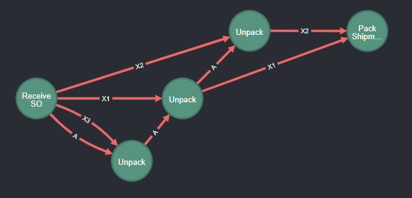
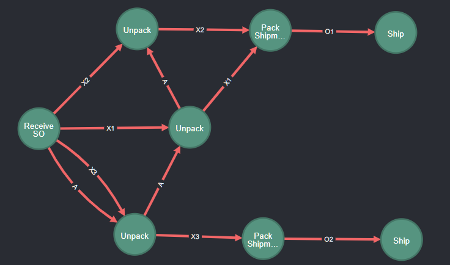

# Tutorial OCPM 5: Generalized Object-Centric Start-to-End Executions

This tutorial is part of a series of tutorials for realizing Object-Centric Process Mining (OCPM) with Event Knowledge Graphs (EKGs).

In two preceding tutorials, we covered
* How to [query object-centric process executions](./tutorial-ocpm-object-centric-process-executions.md), and
* How to [summarize object-centric process executions](./tutorial-ocpm-object-centric-process-executions-summarizing.md).

So far, an **object-centric process execution** is defined as the graph of Event nodes and DF relations between
* the *start event* of specific *single* start object, 
* the *end event* of specific *single* end object.

In this tutorial, we explore how to generalize to
* **arbitrary start/end events**, and
* **multiple start/end objects**.

## 0. Prerequisites

  * You have completed the [the tutorial on building event knowledge graphs](./tutorial-your-first-event-knowledge-graph.md)
     * You have a running instance of Neo4j
     * You have imported events and constructed an EKG
  * You have completed the [OCPM tutorial on analyzing object traces](./tutorial-ocpm-object-traces.md)
  * You have completed the [OCPM tutorial on defining and querying object-centric process executions](./tutorial-ocpm-object-centric-process-executions.md)

## 1. Current EKG - Extended with :Execution Nodes

Through the [tutorial on building EKGs](./tutorial-your-first-event-knowledge-graph.md) you should have constructed [an EKG of the Order process example](./tutorial_images/ocpm-relations/order_process_ekg_full.png "Image of Event Knowledge Graph of the Order Process") containing *:Event* and *:Entity* nodes and *:CORR* and *:DF* relationships.

As a reminder, this EKG contains the following Event Layer (*:Event* nodes and *:DF* relations). 


And it contains the following Object Layer (*:Entity* nodes and [*:REL* relations](./tutorial-ocpm-relations.md))


Further, we extended the EKG with [**:Execution** nodes, each describing an object-centric start-to-end execution](./tutorial-ocpm-object-centric-process-executions.md) between two objects of interest. We identified various process executions. In the following, we use the following 4 executions from *Supplier Orders* *A* and *B* to *Orders* *O1* and *O2* as our running example.


Each grey :Execution node is associated with a single *start object* and a single *end object* having a single *start event* and a single *end event*.

## 2 Choosing Other Start and End points for object-centric executions

Our [query for retrieving an object-centric execution](./tutorial-ocpm-object-centric-process-executions.md#31-querying-object-centric-executions-by-object-types---basic-idea) determines an **object-centric execution** as 
* a collection of paths between 
* a single start event *eStart* being the start event of a chosen "start object" *nStart*
* a single end event *eEnd* being the end event of a chosen "end object" *nEnd*

However, we can make different choices regarding
* how to pick start/end events
* how many start/end events to pick

## 3 From single start to single end by specific activity of specific object

So far, we always picked the start event of the start object to also be the start event of the execution; likewise for the end event. We can also choose the *start event* and the *end event* of the object-centric execution to be given by
* a start object ID + a start activity name
* an end object ID + an end activity name

For example, we can query for executions from *Receive SO* of *Supplier Order A* until *Pack Shipment* of *Order O1*:

```
// Query execution from start object + start activity to end object + end activity
WITH "A" AS startID, "Receive SO" AS startAct, "O1" AS endID, "Pack Shipment" AS endAct
// get start event of start object
MATCH (nStart:Entity {ID:startID})<-[:CORR]-(eStart:Event {Activity: startAct})
// get end event of end object
MATCH (nEnd:Entity {ID:endID})<-[:CORR]-(eEnd:Event {Activity:endAct})
// get path from start event to end event over any :DF relation
MATCH p=(eStart)-[:DF*]->(eEnd)
RETURN p
```

The resulting object-centric execution is shorter than the full execution from the start of *A* to the end of *O1*.



*Note* that the above query only retrieves the execution, but does not materialize it. If you want to materialize this execution, you can simply adapt the [materialization queries](./tutorial-ocpm-object-centric-process-executions.md#32-materializing-multiple-object-centric-executions-based-on-types-of-startend-objects) we introduced earlier.

## 4 From single start event and *any* reachable end event

We can also choose the execution to 
* only have a fixed single start event (such as the start event of a start object) 
* while letting *any* end event of some object be the end event of the execution

For example the following query retrieves the execution that starts with *Receive SO* in *Supplier Order A* and ends anywhere:

```
// Query execution from start object + start activity to end object + end activity
WITH "A" AS startID, "Receive SO" AS startAct
// get start event of start object
MATCH (nStart:Entity {ID:startID})<-[:CORR]-(eStart:Event {Activity: startAct})
// get end event of any possible end object
MATCH (nEnd:Entity)<-[:END]-(eEnd:Event)
// get path from start event to end event over any :DF relation
MATCH p=(eStart)-[:DF*]->(eEnd)
RETURN p
```

This query yields the following "(single) start-to-(multiple) ends execution"



It shows the full process of how *all* them *Items* from this supplier order are handled until shipment. We can see that
* *X1* and *X3* end up in *O1* while
* *X3* ends up in *O2*, and
* there are no other dynamics in the entire process that this supplier order impacts (simply by absence of any other events reachable from the chosen start event).

Conversely, we can define executions which 
* end in a specific end event (end event of some object, or specific activity)
* and start in any start event (global start event or start event of objects of interest)

## 5 Limiting to specific objects

By default, we always consider all DF-paths over any of the DF-edges between start and end point(s). We can also limit the DF-paths to specific objects or object types.

### 5.1 Excluding objects

We can limit DF-paths by excluding specific object types.

The following query retrieves the executions that
* start in *any* *Place SO* activity, i.e., we are not specifying any object or object type
* end in *any* end event of some object, i.e., we again are not specifying any object or object type
* and does not contain any DF-edge related to an *Order*

```
WITH "Place SO" AS startAct
MATCH (eStart:Event {Activity:startAct})
MATCH (eEnd:Event)-[:END]->(:Entity)
MATCH p=(eStart)-[:DF*]->(eEnd) 
WHERE 
    NONE (df in relationships(p) WHERE df.EntityType = "Order")
WITH eStart,eEnd,collect(p) AS execution
RETURN execution
```

Note that we use `WITH eStart,eEnd,collect(p) AS execution` to collect all paths between the same start and end events into a sub-graph (i.e., collection of paths) describing the execution. 

The query returns 4 executions. As usual, the executions overlap, so the returned graph looks as follows:


The query identified *Pack Shipment* events as the only possible end events (of the *Item* entities) reachable from *Place SO* - because we excluded all behavior of the *Order* objects. Thus we have 4 executions starting in *Place SO* (of *A* or *B*) and ending in *Pack Shipment* (of *[X1,X2,Y1]* or *[X3,Y2]*). Note that in addition, the *DF* edge of *Order* *O2* from *Update SO* to *Pack Shipment* is also not part of this execution. 

In other words, this execution shows us a clean view of what happens with all the *Items* that were received - but nothing else.

### 5.2 Limiting to specific object types

Alternatively, we can also limit DF-paths to only involve DF-edges of specific object types (and all other object types are automatically excluded). For example, we could replace `WHERE NONE (df in relationships(p) WHERE df.EntityType = "Order")` by `WHERE (df in relationships(p) WHERE df.EntityType IN ["Supplier Order","Item]])`.


## 6 Object-Centric "Cases"? Taking Single Starts and Partitioning through Excluding Objects

A major challenge in working with object-centric event data compared to classical case-based process mining is that we lack the notion of a clear case. 

Abandoning the view of grouping everything under the same (case) identifier helped us to better model the actula behavior. But the downside is that we no longer have an easy way to structure our data into meaningful units of computation, i.e., a meaningful vantage point to relate our analysis and thinking to.

### 6.1 Object-Centric Cases

The concept of object-centric start-to-end executions is trying to approximate this, but still has many parameters to choose ("Which start and end objects shall we pick?") and challenges (executions overlap significantly).

A classical approach for dealing with multi-object event data always has been to pick a "leading" object type from which the process shall be studied, i.e., an object-centric "case" is the behavior that begins in the start events of the leading object type. This is also known as **leading type extraction** for object-centric cases as proposed in

Jan Niklas Adams, Daniel Schuster, Seth Schmitz, Günther Schuh, Wil M. P. van der Aalst: *Defining Cases and Variants for Object-Centric Event Data.* ICPM 2022: 128-135 https://doi.org/10.1109/ICPM57379.2022.9980730

Conceptually, the idea is to first find all objects related to an object *o* of the leading type - these objects are the objects involved in the process execution initaiated by *o*. And subsequently all events related to these objects are grouped together under one executions.

In the following, we show how object-centric cases can be defined based on *leading object types* but we add the idea of picking either the *start event* or the *end event* as additional vantage point.

### 6.2 Object-Centric Cases based on a Start Event

The following query **realizes leading type extraction on EKGs** - without having to actually gather all the objects. Instead we can simply query for the *DF*-paths that start in the start event of the leading object. We choose the *Order* as the leading type for our process.

```
MATCH (eStart:Event)-[:START]->(:Entity {EntityType: "Order"})
MATCH (eEnd:Event)-[:END]->(:Entity)
MATCH p=(eStart)-[:DF*]->(eEnd) 
WITH eStart,collect(p) AS execution
RETURN execution
```

Note that the query builds the execution by group all paths based on the start event *eStart* only. Running this query returns 2 "leading type" executions (one for each *Order*) in the following graph.


This example immediately also illustrates the downside of the "leading type" exectuion extraction. While both executions indeed begin in the *Order* objects *O1* and *O2* and show the full execution of the orders and the invoices, it also includes behavior of *Supplier Order* *B* and various *Items*.

Worse, the behavior of the *Supplier Orders* and the *Items* is not complete wrt. all data (as we have seen above), i.e. it is *not* showing all *Items* involved in *O1* and *O2* and is showing one *Supplier Order* (*B*) but not the other one.

Generally, such incomplete representation of data is undesirable as it will lead to wrong interpretations and conclusions. Either we show all involved *Items* and both *Supplier Orders* in the same way or none. 

If we are interested in just understanding how *Orders* themselves are handled (without *Supplier Orders* and *Items*) we can [exclude object types](#5-excluding-specific-objects) from the execution. The following query excludes the *Supplier Orders* in the extraction:

```
MATCH (eStart:Event)-[:START]->(:Entity {EntityType: "Order"})
MATCH (eEnd:Event)-[:END]->(:Entity)
MATCH p=(eStart)-[:DF*]->(eEnd) 
WHERE 
    NONE (df in relationships(p) WHERE df.EntityType = "Supplier Order")
WITH eStart,collect(p) AS execution
RETURN execution
```

We obtain 2 simple and clear executions starting in *Place Order* that show the handling of each order and the fact that their *Invoices* are both cleared by the same *Payment*.


Note that this still does not partition our executions into non-overlapping classical cases - but that is simply impossible given that the process itself has synchronizing behavior.

### 6.3 Object-Centric Cases that End an Order

The executions above extract cases taking the *start event* of an order as the vantage point for the case. We can also take the *end event* of an order as the vantage point:

```
MATCH (eStart:Event)-[:START]->(:Entity)
MATCH (eEnd:Event)-[:END]->(:Entity {EntityType: "Order"})
MATCH p=(eStart)-[:DF*]->(eEnd) 
WITH eEnd,collect(p) AS execution
RETURN execution
```

This query returns 2 executions ending in the *Ship* events of the 2 *Orders*:


The executions are certainly more complex as they now also show the behavior that leads to *Pack Shipment*, i.e., the *Items* and *Supplier Orders*. Noticably it does not contain the *Invoices* and *Payments* as these are not involved in completing an *Order*.

As before, we can simplify and scope the execution by excluding the *Supplier Orders*:

```
MATCH (eStart:Event)-[:START]->(:Entity)
MATCH (eEnd:Event)-[:END]->(:Entity {EntityType: "Order"})
MATCH p=(eStart)-[:DF*]->(eEnd) 
WHERE 
    NONE (df in relationships(p) WHERE df.EntityType = "Supplier Order")
WITH eEnd,collect(p) AS execution
RETURN execution
```

This query returns the following 2 executions ending in *Ship* of each of the 2 *Orders* and starting in
* *Order* creation and
* *Receiving* the individual *Items* packed into each *Order*


The executions show what it takes to *complete each Order*. This obviously involves *creating the Order* and packing the individual *Items*. But it also shows that the execution of the orders
* are independent of each other (as classical cases would be), while
* being dependent on the same *Receive SO* events that provide the *Items*.


## 7 Other Forms of Execution and Conclusion

This tutorial broadened our definition of an object-centric execution as a subgraph that
* has at least one well-defined start *or* end point - which can be specified through objects and/or activities, and
* contains all DF-paths that start/end in the chosen start/end point, and
* only involves DF-paths of specific objects (by inclusion or exclusion criteria).

This specifically allowed us to define a form of **object-centric case** where we can pick a single "leading object" under which all behavior is grouped. The central idea is to study either
* which behavior follows after the leading object is created, or
* which behavior precedes or leads to the final event of the leading object.

These executions and cases can also be [materialized](./tutorial-ocpm-object-centric-process-executions.md#32-materializing-multiple-object-centric-executions-based-on-types-of-startend-objects) and subsequently [summarized](./tutorial-ocpm-object-centric-process-executions-summarizing.md) in the same way as the start-to-end executions discussed before. Though the usefulness of the summaries depends on the complexity of the more general executions or cases.

Altogether, the last 3 tutorials on object-centric executions provided us with a variety of concepts and querys to partition, view, and summarize object-centric event data from many angles. Which angle is the right one depends on the analysis question or goal.