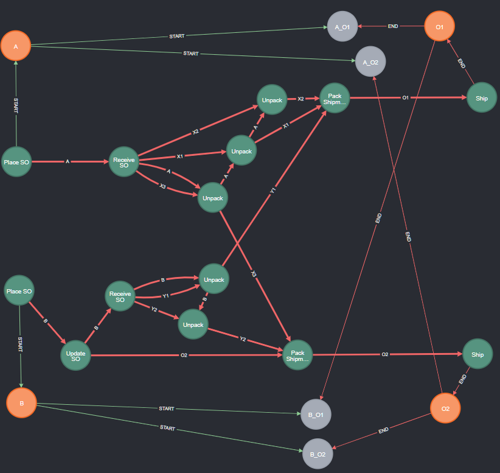
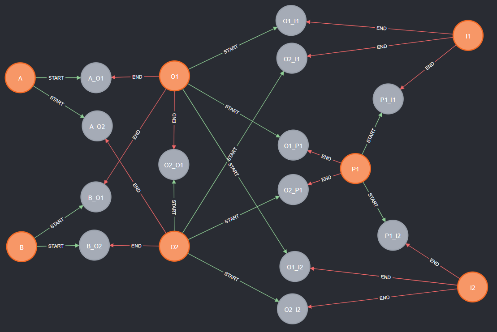

# Tutorial OCPM 4: Summarizing and Analyzing Object-Centric Process Executions

This tutorial is part of a series of tutorials for realizing Object-Centric Process Mining (OCPM) with Event Knowledge Graphs (EKGs).
It is a direct follow-up to the tutorial on [Object-Centric Process Executions](./tutorial-ocpm-object-centric-process-executions.md)

This tutorial explains advanced queries for analyzing object-centric process executions. We cover
  * How to summarize start-to-end executions as a **simple form of object-centric trace variants**: [Section 2](#2-summarizing-object-centric-executions)
  * How to **model object-centric executions on the level of objects**: [Section 3](#3-object-centric-executions-on-the-level-of-objects)
  * How to to use all of the above to generate **a global object-centric summary of an entire EKG**: [Section 4](#4-global-summary-using-global-start-and-end-events)


## 0. Prerequisites

  * You have completed the [the tutorial on building event knowledge graphs](./tutorial-your-first-event-knowledge-graph.md)
     * You have a running instance of Neo4j
     * You have imported events and constructed an EKG
  * You have completed the [OCPM tutorial on analyzing object traces](./tutorial-ocpm-object-traces.md)
  * You have completed the [OCPM tutorial on defining and querying object-centric process executions](./tutorial-ocpm-object-centric-process-executions.md)

## 1. Current EKG - Extended with :Execution Nodes

Through the [tutorial on building EKGs](./tutorial-your-first-event-knowledge-graph.md) you should have constructed [an EKG of the Order process example](./tutorial_images/ocpm-relations/order_process_ekg_full.png "Image of Event Knowledge Graph of the Order Process") containing *:Event* and *:Entity* nodes and *:CORR* and *:DF* relationships.

As a reminder, this EKG contains the following Event Layer (*:Event* nodes and *:DF* relations). 


And it contains the following Object Layer (*:Entity* nodes and [*:REL* relations](./tutorial-ocpm-relations.md))


Further, we extended the EKG with [**:Execution** nodes, each describing an object-centric start-to-end execution](./tutorial-ocpm-object-centric-process-executions.md) between two objects of interest. We identified various process executions. In the following, we use the following 4 executions from *Supplier Orders* *A* and *B* to *Orders* *O1* and *O2* as our running example.



Each grey :Execution node is associated with a single *start object* and a single *end object* having a single *start event* and a single *end event*.

## 2 Why Summarize Object-Centric Executions?

While we are able to [build and visualize *all* object-centric executions in a dataset](./tutorial-ocpm-object-centric-process-executions.md#4-which-object-centric-executions-are-in-the-example-data), we also would like the ability to get a **quick overview** over all object-centric executions.

Getting such an overview requries to create (more compact) summaries of object-centric executions. We here explore two ideas. 
* One based on [summarizing the execution's events in terms of their activities](#4-summarizing-object-centric-executions-via-activities-trace-variantss) (similar to trace variants), and 
* one based on summarizing the exectution in terms of the involved objects.

### 3 Summarizing Object-Centric Executions via Activities: "Trace Variants"s

As each object-centric execution is collections of DF-paths, we can try to adapt the idea of object trace variants from the [OCPM Tutorial on Object Traces](./tutorial-ocpm-object-traces.md). 

We first explore here two options that will turn out less useful as actual summaries, but educational. We then propose a third option that will be more effective as summary (though having some downsides as well).

#### 3.1 Attempt 1: Summarize all DF-paths

Our first (naive) attempt to obtain an execution summary is to copy the idea of object-trace variants: we simply map each DF-path in an execution to the sequence of activities.

```
// Retrieve executions between start/end objects of the same type
WITH "Supplier Order" AS startType, "Order" AS endType
MATCH (nStart:Entity {EntityType:startType}) -[:START]-> (x:Execution) <-[:END]- (nEnd:Entity {EntityType:endType})
  // Retrieve all DF-paths of exectution (between its start and end events)
  MATCH (eStart:Event) -[:START]-> (x) <-[:END]- (eEnd:Event)
  MATCH p=(eStart)-[:DF*]->(eEnd)
// Map each DF-path between (start,end) object pair to its activities
RETURN nStart.ID, nEnd.ID AS end, [event IN nodes(p) | event.Activity] AS trace
```

However, the result contains a lot of traces between the same two objects and several duplicates:

| nStart.ID | nEnd.ID  | trace |
|-----------|----------|-------|
| "A"	| "O1" | ["Place SO", "Receive SO", "Unpack", "Pack Shipment", "Ship"] |
| "A"	| "O1" | ["Place SO", "Receive SO", "Unpack", "Unpack", "Unpack", "Pack Shipment", "Ship"] |
| "A"	| "O1" | ["Place SO", "Receive SO", "Unpack", "Unpack", "Unpack", "Pack Shipment", "Ship"] |
| "A"	| "O1" | ["Place SO", "Receive SO", "Unpack", "Unpack", "Pack Shipment", "Ship"] |
| "A"	| "O1" | ["Place SO", "Receive SO", "Unpack", "Unpack", "Pack Shipment", "Ship"] |
| "A"	| "O1" | ["Place SO", "Receive SO", "Unpack", "Unpack", "Pack Shipment", "Ship"] |
| "A"	| "O1" | ["Place SO", "Receive SO", "Unpack", "Pack Shipment", "Ship"] |
|   |    |    |
| "B"	| "O1" | ["Place SO", "Update SO", "Receive SO", "Unpack", "Pack Shipment", "Ship"] |
| "B"	| "O1" | ["Place SO", "Update SO", "Receive SO", "Unpack", "Pack Shipment", "Ship"] |
|   |    |    |
| "A"	| "O2" | ["Place SO", "Receive SO", "Unpack", "Pack Shipment", "Ship"] |
| "A"	| "O2" | ["Place SO", "Receive SO", "Unpack", "Pack Shipment", "Ship"] |
|   |    |    |
| "B"	| "O2" | ["Place SO", "Update SO", "Receive SO", "Unpack", "Unpack", "Pack Shipment", "Ship"] |
| "B"	| "O2" | ["Place SO", "Update SO", "Receive SO", "Unpack", "Unpack", "Pack Shipment", "Ship"] |
| "B"	| "O2" | ["Place SO", "Update SO", "Receive SO", "Unpack", "Pack Shipment", "Ship"] |
| "B"	| "O2" | ["Place SO", "Update SO", "Pack Shipment", "Ship"] |

If we compare this with the graph of the execution shown above, we can see that indeed each of these traces has a corresponding path in the EKG as we find parallel **:DF** edges and also multiple paths between intermediate event nodes in the EKG. However, we would like less redundancy in our summary.

### 3.2 Attempt 2: all unique activity paths per start-end object pair

One possibility is to remove all duplicate start-to-end trace variants in the result set (by using `DISTINCT` when mapping path *p* to *trace*) and subsequently collecting all trace variants between the same two objects.

```
// Retrieve executions between start/end objects of the same type
WITH "Supplier Order" AS startType, "Order" AS endType
MATCH (nStart:Entity {EntityType:startType}) -[:START]-> (x:Execution) <-[:END]- (nEnd:Entity {EntityType:endType})
  // Retrieve all DF-paths of exectution (between its start and end events)
  MATCH (eStart:Event) -[:START]-> (x) <-[:END]- (eEnd:Event)
  MATCH p=(eStart)-[:DF*]->(eEnd)
// Map each unique DF-path between a start object and end object to its activities
WITH DISTINCT nStart, nEnd, [event IN nodes(p) | event.Activity] AS trace
// collect all trace variants between the same objects
RETURN DISTINCT nStart.ID, nEnd.ID, collect(trace) AS variants
```

Note that the query only differs in the last two statements which maps paths to `DISTINCT` traces and then to `DISTINCT` variants.

This results in the following trace variants:

| nStart.ID | nEnd.ID | variants |
|-----------|---------|------------|
| "A" | "O1" | [["Place SO", "Receive SO", "Unpack", "Pack Shipment", "Ship"], |
|     |      | ["Place SO", "Receive SO", "Unpack", "Unpack", "Unpack", "Pack Shipment", "Ship"], |
|     |      | ["Place SO", "Receive SO", "Unpack", "Unpack", "Pack Shipment", "Ship"]] |
| "B" | "O1" | [["Place SO", "Update SO", "Receive SO", "Unpack", "Pack Shipment", "Ship"]] |
| "A" | "O2" | [["Place SO", "Receive SO", "Unpack", "Pack Shipment", "Ship"]] |
| "B" | "O2" | [["Place SO", "Update SO", "Receive SO", "Unpack", "Unpack", "Pack Shipment", "Ship"], |
|     |      | ["Place SO", "Update SO", "Receive SO", "Unpack", "Pack Shipment", "Ship"], |
|     |      | ["Place SO", "Update SO", "Pack Shipment", "Ship"]] |

This result looks unusual and complex at the first glance as we may now have multiple start-to-end trace variants between two objects. However, these individual variants do have a valid interpretation:
* *B* to *O1* only has one trace variant (i.e. one path) from *B* to *O1* as there is only one other object (*Item Y1*) involved in this trace.
* *A* to *O2* likewise
* *A* to *A1* has three trace variants as there are three principle paths from *A* to *O1* (see the graph-based visualiation of the start-to-end execution above), each involving a distinct *other* object:
  * the path via *X1* (*Receive*, *Unpack*, and *Pack...* *X1*)
  * the path via *X2* (*Receive*, *Unpack*, and *Pack...* *X2*)
  * the path via the first *Unpack* event relating to *X3* that the Supplier Order *A* also hsa to go through before *X1* and *X2* can be unpacked.
* *B* to *O2* likewise

Arguably, these paths are not always obvious to interpret, they these trace variants to encode distinct characteristics of each start-to-end execution.

### 3.3 Simple Start-to-End Execution Variant: Global Activity Sequence

Another possiblity is to abstract from the actual graph structure of an execution (which gives rise to the multiple DF-paths and activity sequences) and **only consider the Events in the execution ordered by time**. In other words, we aggregate all behavior between two objects into a *single feature*, i.e., a single event sequence between two objects. 

The following query retrieves all events related to the same Execution node and orders them by time. This results in an event sequence of all the events in the object-centric execution, i.e., a classical trace from the start object to the end object. This event sequence is then mapped to an activity sequence.

```
// Query simple execution variants between start/end objects of the same type
WITH "Supplier Order" AS startType, "Order" AS endType
  // retrieve events per execution
  MATCH (nStart:Entity {EntityType:startType}) -[:START]-> (x:Execution) <-[:END]- (nEnd:Entity {EntityType:endType})
  OPTIONAL MATCH (event:Event) -[:CORR]-> (x)
// collect events per start and end object into totally ordered sequence of events
WITH nStart, nEnd, event ORDER BY event.timestamp
WITH nStart, nEnd, collect(event) AS events
// map event sequence to activity sequence, i.e., execution variant
RETURN nStart.ID,nEnd.ID,[event in events | event.Activity] AS variant
```

Running this query results in the following simple object-centric execution variants between **Supplier Orders** and **Orders**.

| nStart.ID | nEnd.ID | trace |
|-----------|---------|------------|
| "A" | "O1" | ["Place SO", "Receive SO", "Unpack", "Unpack", "Unpack", "Pack Shipment", "Ship"] |
| "A" | "O2" | ["Place SO", "Receive SO", "Unpack", "Pack Shipment", "Ship"] |
| "B" | "O1" | ["Place SO", "Update SO", "Receive SO", "Unpack", "Pack Shipment", "Ship"] |
| "B" | "O2" | ["Place SO", "Update SO", "Receive SO", "Unpack", "Unpack", "Pack Shipment", "Ship"] |

It lists for each pair of objects the activities observed, ordered by time. While it abstracts from and hides the more complex object dynamics, it gives a quick overview of how these start-to-end executions differ from each other. To gather an overview on the data, this simple execution variant seems more applicable than the previous proposals that summarize the entire graph structure.

### 3.4 Materializing Execution Summary: add activityVariant property to :Exectuion node

Building an activity summary requires (some) computational effort. If we want to analyze and compare this summary repeatedly, we can spare the computational effort (and the shorten the queries) by *materializing* the summary of an execution as a new property of the Execution node itself.

The following query does that - for any execution node that has been computed so far.

```
// Materialize activity variant of object-centric execution as property
// get execution
MATCH (x:Execution)
// get events and order them
OPTIONAL MATCH (event:Event) -[:CORR]-> (x)
WITH x, event ORDER BY event.timestamp
WITH x, collect(event) AS events
// map event sequence to activity sequence, i.e., execution variant
WITH x, [event in events | event.Activity] AS variant
SET x.activityVariant = variant
```

*Note* that this query is not parameterized wrt. a particular start/end object types, i.e., it works for any execution. We can use `WHERE` clauses or matching patterns to limit this to specific executions, if needed.

We then can retrieve the activity variant of all executions with `MATCH (x:Execution) RETURN x.activityVariant` -  we will use that when generating a [global summary of all executions](#5-global-summary-of-executions-in-object-centric-event-data).

## 4 Object-Centric Executions on the Level of Objects

So far, we described object-centric executions in terms of events (as a trace, a collection of traces forming a sub-graph, and by mapping event traces to activity sequences).

But EKGs and object-centric event data also has an **object layer**. 

So let's explore how we can describe executions in terms of the involved objects. Also here, we will first explore some ideas that turn out unsatisfactorily but educational before we arrive at a more promising proposal.

For this, we need relations between objects as established in the [OCPM Tutorial on Building and Analyzing Object Relations](./tutorial-ocpm-relations.md). 

### 4.1 Querying Object Paths between Start end End Objects

We continue with the idea of describing executions as paths or sub-graphs from a start object to an end object. We can easily query such paths between **:Entity** nodes along the **:REL** relationships between them. However, we cannot rely on the *direction* of the **:REL** relationships, so we have to query for **undirected paths**. Though, the following naive query "catches" more than we want.

```
// Query all undirected object paths between a start object and an end object
WITH "A" AS startID, "O1" AS endID
MATCH (nStart:Entity {ID:startID})
MATCH (nEnd:Entity {ID:endID})
// retrieve all undirected paths between start object nStart and end object nEnd
MATCH p=(nStart)-[:REL*]-(nEnd)
RETURN p
```

For the start object *Supplier Order A* and the end object *Order O1* the query returns the full graph of all objects.


This is because *O1* and *A* are connected also via other undirected paths, not just the direct or shortest paths.

We can query for all shortest paths between two objects *A* and *O1*  (e.g., using Neo4j's dedicated function `allShortestPaths(..)` or a more recent Cypher version supporting shorest path search) with the following query:

```
// Query all undirected object paths between a start object and an end object
WITH "A" AS startID, "O1" AS endID
MATCH (nStart:Entity {ID:startID})
MATCH (nEnd:Entity {ID:endID})
// retrieve all undirected paths between start object nStart and end object nEnd
MATCH p=allShortestPaths((nStart)-[:REL*]-(nEnd))
RETURN p
```


This result indeed shows only *A*, and *O1*, and the two items *X1,X2* received via *A* and shipped by *O1*. 

However, this query does not always work: 
* first, it hides that the start-to-end execution from *A* to *O1* also does involve other items, such as *X3* (supplied by *A*) or *Y1* (needed by *O1*)
* second, the search for a shortest path may also omit objects

The below query combines with with searching for the paths between all source and target objects of the same type.

```
// Query all shortest undirected object paths between object of startType and objects of endType
WITH "Supplier Order" AS startType, "Order" AS endType
MATCH (nStart:Entity {EntityType:startType})
MATCH (nEnd:Entity {EntityType:endType})
// retrieve all shortest undirected paths between start object nStart and end object nEnd
MATCH p=allShortestPaths((nStart)-[:REL*]-(nEnd))
return p
```

By searching for shorest paths only, the result is unfortunately missing *Item Y2* which is received by *B* and shipped by *O2*:


The reason is that the execution of *B* and *O2* encountered a deviation in an *Update SO* event that is correlated to both *B* and *O2* (as shown via the manually added event nodes). As a result, the shortest path between *B* and *O2* does not describe the execution from *B* to  *O2* on an object level.

While the query for shortest objects paths does give us interesting insights into the process and deviations, it is not a faithful abstraction of executions to the object level.

### 4.2 Abstracting Object-Centric Executions to Graphs of Objects and Object-to-Object Relations

Remember that each **:Event** in the *Event Layer* of the EKG is linked to **:Entity** nodes in the *Object Layer* of the EKG via **:CORR** relationships. So, we can map all the execution's events in the event layer to the related entity nodes in the object layer.

The following query does this for the execution from *Supplier Order A* to *Order O1*:

```
// Find graph of objects and relations involved in a specific object-centric execution
WITH "A" AS startID, "O1" AS endID
  // get execution
  MATCH (nStart:Entity {ID:startID}) -[:START]-> (x:Execution) <-[:END]- (nEnd:Entity {ID:endID})
  // get objects connected to any of the events in the execution
  MATCH (n:Entity) <-[:CORR]- (:Event) -[:CORR]-> (x)

// get all distinct objects involved in the execution...
WITH DISTINCT nStart, nEnd, n
WITH nStart,nEnd, collect(n) as objects
// ... and find the object relations between the 'objects' along the path 
WITH objects, [ (n1:Entity)-[r:REL]-(n2:Entity) WHERE n1 IN objects AND n2 IN objects | r ] AS relations
RETURN objects, relations
```

Executing this query yields the following graph of objects and object-to-object relations for the object-centric execution from *A* to *O1*:


This object graph clearly is more complex than the previous object graph based on the shortest paths, but it is - arguably - a **"context-aware object-level representation of the object-centric execution**. It correctly shows
* the objects of the execution itself consisting of 
  * start object *Supplier Order A* 
  * the end object *Order O1*
  * the 2 *Items X1,X2* supplied by *A* and shipped by *O1* on the (undirected) paths from *A* to *O1*
* and the direct **"object context"** of the execution in terms of
  * the other *Item X3* supplied by *A* but not used by *O1* (i.e., this object "leaves" the execution)
  * the other *Item Y2* used by *O1* but not supplied by *A* (i.e., this object "enters" the execution)

Using the above `WITH "B" AS startID, "O2" AS endIDType` yields the following graph of objects and object-to-objects relations for the object-centric execution from *B* to *O2*:


Also here, we see the 
* the objects of the execution itself consisting of 
  * start object *Supplier Order A* 
  * the end object *Order O1*
  * the *Items Y2* supplied by *B* and shipped by *O2* on the (undirected) path from *B* to *O2*
  * the direct relationship from *B* to *O2* due to the synchronzing *Update SO* event
* and the direct **"object context"** of the execution in terms of
  * the other *Item Y1* supplied by *B* but not used by *O2* (i.e., this object "leaves" this execution and "enters" the execution from *A* to *O1*)
  * the other *Item X3* used by *O2* but not supplied by *B* (i.e., this object "enters" the execution, coming from the executoin from *A* to *O1*)

Of course, we can also return the entire object-graph for all executions between objects of source and target types with

```
// Find graph of objects and relations involved in object-centric execution between start/end object types
WITH "Supplier Order" AS startType, "Order" AS endType
  // get execution
  MATCH (nStart:Entity {EntityType:startType}) -[:START]-> (x:Execution) <-[:END]- (nEnd:Entity {EntityType:endType})
  // get objects connected to any of the events in the execution
  MATCH (n:Entity) <-[:CORR]- (:Event) -[:CORR]-> (x)

// get all distinct objects involved in the execution...
WITH DISTINCT nStart, nEnd, n
WITH nStart,nEnd, collect(n) as objects
// ... and find the object relations between the 'objects' along the path 
WITH objects, [ (n1:Entity)-[r:REL]-(n2:Entity) WHERE n1 IN objects AND n2 IN objects | r ] AS relations
RETURN objects, relations
```

Running this query returns the following object graph for all executions between *Supplier Orders* and *Orders*.


It now correctly shows 
* all objects involved in these executions (including *Item Y2*)
* that all *Items* are on a path from a *Supplier Order* to an *Order*, i.e., there are no *Items* that are handled outside the queried executions (we could say the executions is "closed" wrt. the *Items*)

### 4.3 Object Variants: Summarizing Object Graphs of Object-Centric Executions

Similarly to summarizing the graph of a object-centric start-to-end execution into a "object-centric trace variant", we can summarize the object graph of an object-centric execution. For this, we simply combine both ideas of querying object graphs and object-centric trace variants into one query:

```
// Summarize start-to-end executions between start and an end objects of a given type in terms of involved objects
WITH "Supplier Order" AS startType, "Order" AS endType
  // get execution
  MATCH (nStart:Entity {EntityType:startType}) -[:START]-> (x:Execution) <-[:END]- (nEnd:Entity {EntityType:endType})
  // get objects connected to any of the events in the execution
  MATCH (n:Entity) <-[:CORR]- (:Event) -[:CORR]-> (x)

// get all distinct objects involved in the execution...
WITH DISTINCT nStart, nEnd, n ORDER BY n.ID
// ... and compute variant per start-end object pair (object ids and object types)
WITH nStart,nEnd, collect(n.ID) as objects, collect(n.EntityType) as objectTypes
RETURN nStart.ID, nEnd.ID, objects, objectTypes
```

This query returns the following **object variant summary** of the start-to-end executions between *Supplier Orders* and *Orders*

| nStart.ID | nEnd.ID | objects | objectTypes |
|-----------|---------|---------|-------------|
| "A" | "O1" | ["A", "O1", "X1", "X2", "X3", "Y1"] | ["Supplier Order", "Order", "Item", "Item", "Item", "Item"] |
| "B" | "O1" | ["B", "O1", "O2", "X1", "X2", "Y1", "Y2"] | ["Supplier Order", "Order", "Order", "Item", "Item", "Item", "Item"] |
| "A" | "O2" | ["A", "O2", "X1", "X2", "X3", "Y2"] | ["Supplier Order", "Order", "Item", "Item", "Item", "Item"] |
| "B" | "O2" | ["B", "O2", "X3", "Y1", "Y2"] | ["Supplier Order", "Order", "Item", "Item", "Item"] |

It show us that 
* all executions involve *Supplier Orders*,  *Orders*, and *Items*;
* both executions from *A* to *O1* and to *O2* each 
  * have the same **object type variant** (i.e., similar to having the same sequence of activities) in involving *1 Supplier Order*, *4 Items*, and *1 Order*,
  * though they differ in the **objects involved** (i.e., similar to how different traces involve different concrete events of the same activities) with *Y1* vs *Y2* and *O1* vs *O2*;
* the execution from *B* to *O1* involves *2 Orders*, which is explained by the deviating event of *Update SO* that also touches *O2* as can be see in the objects involved;
* the execution from *B* to *O2* involves the least number of objects (only 5)

Note that the sequence of object IDs and object types is not a representation of when or how often a particular object was touched or involved in the trace. An object involved in the execution is included once in the results, regardless of how often it is involved. For example, in *B*-*O2*, *O2* is mentioned once although it is involved multiple times (first at the beginning with *Update SO* and then at the end with *Pack Shipment* and *Ship*). In Neo4j, the provided query happens to retain the order of occurrence of objects, but this is no guaranteed behavior.

### 4.4 Materializing Execution Summary: add objectVariant and objectTypeVariant property to :Exectuion node

Similar to the activity variant, we can materialize the object variant (objects and their types) as properties of the Execution node itself with the following query.

```
// Materialize object variant of object-centric execution as property
// get execution
MATCH (x:Execution)
// get all distinct objects involved in the execution
OPTIONAL MATCH (n:Entity) <-[:CORR]- (:Event) -[:CORR]-> (x)
WITH DISTINCT x, n ORDER BY n.ID
// ... and compute variant per start-end object pair (object ids and object types)
WITH x, collect(n.ID) as objectVariant, collect(n.EntityType) as objectTypeVariant
SET x.objectVariant = objectVariant, x.objectTypeVariant = objectTypeVariant
```

We then can retrieve, for example, the object type variant of all executions with `MATCH (x:Execution) RETURN x.objectTypeVariant` -  we will use that when generating a [global summary of all executions](#5-global-summary-of-executions-in-object-centric-event-data).

## 5 Global Summary of Executions in Object-Centric Event Data

Until now, we disussed how to create a summary for a specific set of object-centric executions (e.g., between two types of objects). But summaries are specifically useful if we can apply it on *all* executions.

To get a summary of all executions, we build on the queries to find [all object-centric executions in an EKG](./tutorial-ocpm-object-centric-process-executions.md#4-which-object-centric-executions-are-in-the-example-data). These queries identifed all object-centric executions which
* start in an start object having a global start event (no other preceding event), and
* end in an end object having  a global end event (no other succeeding event).

On our example date, this resulted in the following 13 executions (retrieved with `MATCH (yStart:Entity)-[s:START]->(x:Execution)<-[e:END]-(yEnd:Entity) RETURN yStart,s,x,e,yEnd`):



We then automatically created and materialized summaries for all of these executions by using the queries 
* for [materializing activity variants](#34-materializing-execution-summary-add-activityvariant-property-to-exectuion-node) which extends each *Execution* node with an *activityVariant* property, and
* for [materializing object type variants](#44-materializing-execution-summary-add-objectvariant-and-objecttypevariant-property-to-exectuion-node) which extends each *Execution* node with an *objectTypeVariant* property.

We now want to get an overview which executions follow the same activity or object type variant. For this, 
* we retrieve the from each execution the variant property and the start/end object ids, and
* collect all (start,end) object-pairs having the same variant (activity or objects) into a list.

For clarity, we also want to sort the list by frequency.

### 6.1 Global Summary of Executions as Activity Variants

The following query summarize the *Execution* nodes into **global summary of all executions as activity variants**.

```
// Summarize all start-to-end executions in terms of involved activities
// get all executions and their start/end objects
MATCH (x:Execution)
MATCH (nStart:Entity) -[:START]-> (x) <-[:END]- (nEnd:Entity)
// and group (start,end) object pairs by variant
WITH DISTINCT [nStart.ID, nEnd.ID] AS pair,  x.activityVariant AS variant
RETURN variant, collect( pair ) as start2end ORDER BY size(start2end) DESC, variant ASC
```

This query returns the following global summary of executions in terms of activity variants:

| variant | start2end |
|-------|-----------|
| ["Create Order", "Create Invoice", "Clear Invoice"] |	[["O1", "I1"], ["O1", "I2"], ["O1", "P1"]] |
| ["Create Order", "Create Invoice", "Update Invoice", "Clear Invoice"]	| [["O2", "I1"], ["O2", "I2"], ["O2", "P1"]] |
| ["Receive Payment", "Clear Invoice"] |	[["P1", "I1"], ["P1", "I2"]]
| ["Create Order", "Create Invoice", "Update SO", "Receive SO", "Unpack", "Pack Shipment", "Ship"] |	[["O2", "O1"]] |
| ["Place SO", "Receive SO", "Unpack", "Pack Shipment", "Ship"] |	[["A", "O2"]] |
| ["Place SO", "Receive SO", "Unpack", "Unpack", "Unpack", "Pack Shipment", "Ship"] |	[["A", "O1"]] |
| ["Place SO", "Update SO", "Receive SO", "Unpack", "Pack Shipment", "Ship"] |	[["B", "O1"]] |
| ["Place SO", "Update SO", "Receive SO", "Unpack", "Unpack", "Pack Shipment", "Ship"] |	[["B", "O2"]] |

### 6.2 Global Summary of Executions as Object Variants

The following query summarize the *Execution* nodes into **global summary of all executions as object type variants**.

```
// Summarize all start-to-end executions in terms of involved objects
// get all executions and their start/end objects
MATCH (x:Execution)
MATCH (nStart:Entity) -[:START]-> (x) <-[:END]- (nEnd:Entity)
// get objects connected to any of the events in the execution
WITH DISTINCT [nStart.ID,nEnd.ID] as pair, x.objectTypeVariant AS variant
RETURN variant, collect( pair ) as start2end ORDER BY size(start2end) DESC, variant ASC
```

This query returns the following global summary of executions in terms of object type variants:

| variant | start2end |
|-------------|-----------|
| ["Invoice", "Invoice", "Order", "Payment"] | [["O1", "I1"], ["O2", "I1"], ["O2", "I2"], ["O1", "I2"], ["O1", "P1"], ["O2", "P1"]] | 
| ["Invoice", "Invoice", "Payment"]| [["P1", "I1"], ["P1", "I2"]] | 
| ["Supplier Order", "Order", "Item", "Item", "Item", "Item"] | [["A", "O1"], ["A", "O2"]] |
| ["Supplier Order", "Invoice", "Order", "Order", "Item", "Item", "Item", "Item"] | [["O2", "O1"]] |
| ["Supplier Order", "Order", "Item", "Item", "Item"] | [["B", "O2"]] |
| ["Supplier Order", "Order", "Order", "Item", "Item", "Item", "Item"] | [["B", "O1"]] |

## 7 Wrap-Up

This tutorial showed how to 
* summarize [object-centric start-to-end executions](./tutorial-ocpm-object-centric-process-executions.md) as **simple form of object-centric trace variants** in terms of **activities**
* how to analyze start-to-end executions in terms of the involved objects - thereby revealing also ways to understand how individual executions depend on objects from other executions, and
* overall how to summarize an entire EKG using all the above ideas in a **global object-centric event data summary**

By doing this, we also established key tools for understand and summarizing object-centric event data:
  * We have the ability identify **different start-to-end dynamics** in the **complex network of objects and events** 
  * We have the ability to compare different start-to-end dyanmics of the same kind, allowing to understand similarities and differences, i.e., opening the possibility to detect outliers
  * The proposed concepts are similar to established process mining aggregations such as trace variants, allowing analysis to engage with them
  * We found completely new ways to understand start-to-end dynamics in terms of objects (instead of interms of activities)

Crucially across the [preceding tutorial on executions](./tutorial-ocpm-object-centric-process-executions.md) and this tutorial, we showed
  * how to materialize analysis important abstraction of the data (such as sub-graphs describing executions) as nodes, and
  * how to materialize analysis results on these abstractions (such as execution variants) by enriching nodes with properties.

This approach allows is to step-by-step extend the EKG with more and more process-specific abstractions of the complex data and results and insights that can be referred to and built upon in subsequent steps.

A **follow-up tutorial** explore how to
* [Define and Query other Forms of Object-Centric Process Executions](./tutorial-ocpm-object-centric-process-executions-generalized.md)