# Tutorial OCPM 3: Defining and Querying Object-Centric Process Executions

This tutorial is part of a series of tutorials for realizing Object-Centric Process Mining (OCPM) with Event Knowledge Graphs (EKGs).

This tutorial explains advanced queries for analyzing the behavior in an EKG. We cover
  * How to generalize the concept of a trace from an object to a set of related objects: [Section 2](#2-generalizing-object-traces-to-object-centric-executions)
  * How to generalize the concept of a trace to a sub-graph of an **object-centric start-to-end execution** involving multiple objects: [Section 2](#2-generalizing-object-traces-to-object-centric-executions)
  * How to query for and store information about multiple start-to-end executions of the same kind: [Section 3](#3-querying--materializing-multiple-object-centric-executions)
  * How to query and interpret all start-to-end executions in an EKG: [Section 4](#4-which-object-centric-executions-are-in-the-example-data)

Two follow-up tutorials explore how to [Summarize and Analyze Object-Centric Process Executions](./tutorial-ocpm-object-centric-process-executions-summarizing.md) and how to [Define and Query other Forms of Object-Centric Process Executions](./tutorial-ocpm-object-centric-process-executions-generalized.md)

## 0. Prerequisites

  * You have completed the [the tutorial on building event knowledge graphs](./tutorial-your-first-event-knowledge-graph.md)
     * You have a running instance of Neo4j
     * You have imported events and constructed an EKG
  * You have completed the [OCPM tutorial on inferring relations between objects](./tutorial-ocpm-relations.md)

## 1. Current EKG

Through the [tutorial](./tutorial-your-first-event-knowledge-graph.md) you should have constructed the following EKG 

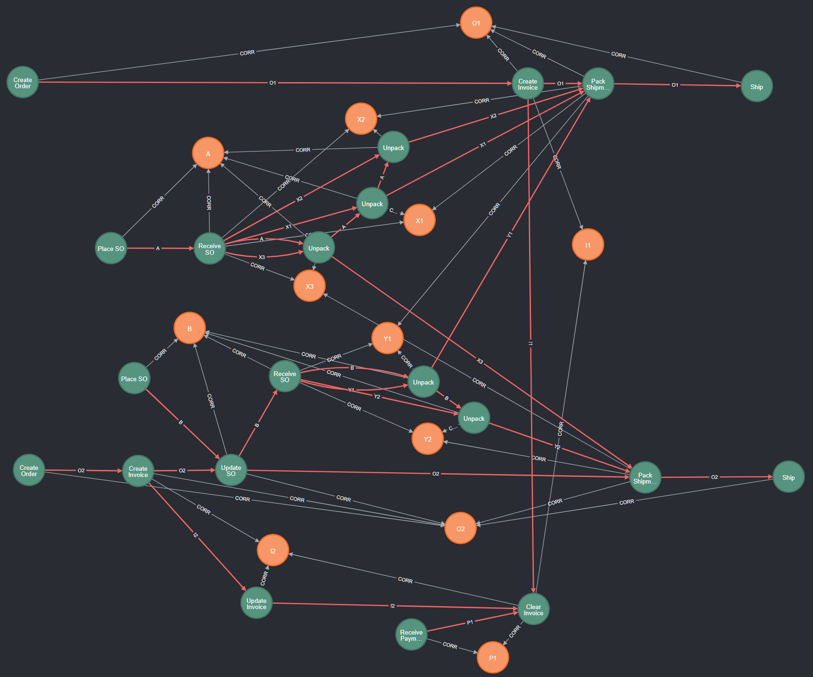

It contains following types of nodes
  * **:Event** nodes, shown in green, describing occurrences of an activity at a particular point in time, furter described by various properties
  * **:Entity** nodes, shown in orange, describing the process objects and other entities in the process
  * **:CORR** (correlation) relationships, shown in grey, where  `(e:Event) -[:CORR]-> (n:Entity)` states that event *e* refers to entity *n*
  * **:DF** (directly-follows) relationships, shown in red, where `(e1:Event) -[:DF { ID:"o1" }]-> (e2:Event)` states that event *e1* is directly followed by event *e2* from the perspective of an entity *n* with `n.ID=o1`

### 1.1 Event Layer of the EKG

Querying only for events and df-relations with `match (e1:Event)-[df:DF]->(e2:Event) return e1,df,e2` shows us this **behavioral part** of the EKG

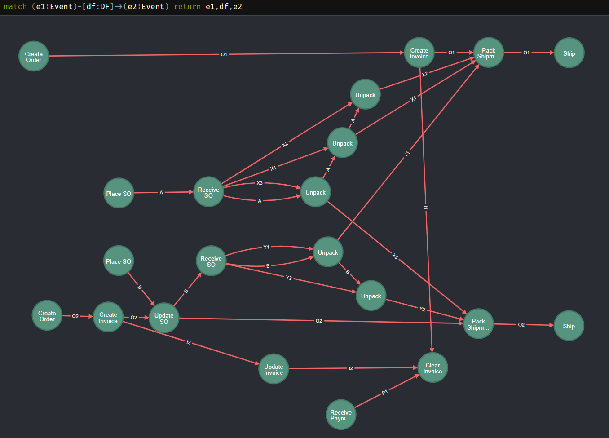

It describes the process execution in an object-centric way, ordering events not wrt. to a global case identifier but wrt. the individual objects the events are correlated to. See also the Open Access Book Chapter [Process Mining over Multiple Behavioral Dimensions with Event Knowledge Graphs](https://link.springer.com/chapter/10.1007/978-3-031-08848-3_9).

### 1.2 Object Layer of the EKG

We can query the object part of the EKG using
```
MATCH (n:Entity)
OPTIONAL MATCH (n:Entity)-[r]-(n2:Entity)
RETURN n,r,n2
```
which returns all :Entity nodes and (optionally) all relations between :Entity nodes. Doing so on this EKG returns the **object part** of the EKG.

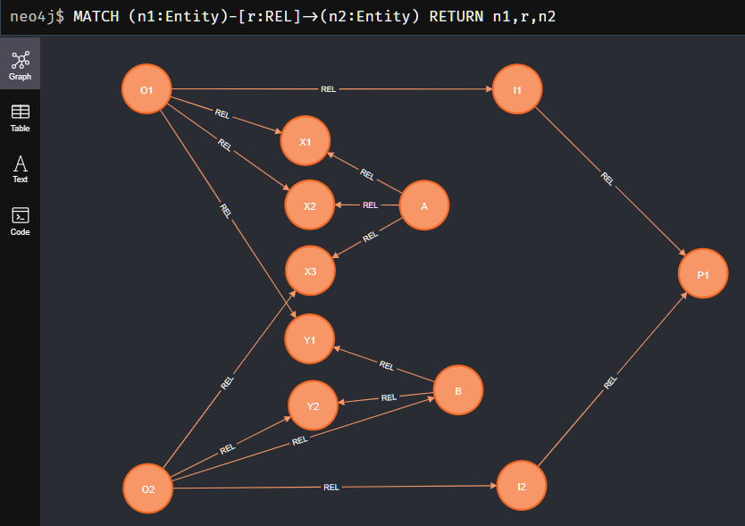

## 2. Generalizing Object Traces to Object-Centric Executions

The [OCPM tutorial on analyzing object traces](./tutorial-ocpm-object-traces.md) uses the following query to retrieve the trace of an individual object. Recall, that as part of this tutorial we inferred the **:START** and **:END** relationships to materialize knowledge about the start and end events of an object.

```
// Query trace (directly-follows path) of a specific object (or entity) identified by 'objId'
WITH "O1" as objId
// retrieve start and end events
MATCH (e1:Event)-[:START]->(n:Entity {ID:objId})<-[:END]-(eN:Event)
// retrieve path from start to end event, along all DF relationships referring to objects identifier
MATCH p=(e1)-[:DF* {ID:n.ID}]->(eN)
// return the entire path
RETURN p
```

While querying for object traces gives us insights into the behavior of all objects individually, the traces of different objects synchronize in events that are related to multiple objects. As a result, the behavior in an object-centric process goes beyond a single object. 

To analyze such behavior the spans across multiple objects, we have to change our definition of a trace and how to query it.

A trace of a classical case and an object trace is a sequence or path of events that
* begins at the start event of the object/case,
* ends at the end event of the object/case, and
* contains only the events of the object/case between start and end.

Going beyond single objects, we can define a **general trace** as a sequence or path of events that
* begins at some starting event, for example the start event of some "start object",
* end at some ending event, for example the end event of some "end object", and
* contains only the events between start and end.

We will quickly see that the 3rd condition has quite some room for interpretation. However, to get started let us take a simple interpretation of "a (shortest) path from start to end".

### 2.1 Querying a path between a start object and an end object

We easily adapt the trace object query to a query that retrieves a general trace between a start object, say *Order O1* which can be seen as the beginning of the order process, and an end object, say Payment *P1* which can be seen as the conclusion of the order process:

```
// Query trace from start object to end object 
WITH "O1" AS start, "P1" AS end
// get start event of start object
MATCH (nStart:Entity {ID:start})<-[:START]-(eStart:Event)
// get end event of end object
MATCH (nEnd:Entity {ID:end})<-[:END]-(eEnd:Event)
// get path from start event to end event over any :DF relation
MATCH p=(eStart)-[:DF*]->(eEnd)
RETURN p
```

Note that we now query a path `MATCH p=(eStart)-[:DF*]->(eEnd)` over **:DF relations of any object** as we are now searching for traces across objects. Executing this query returns the following trace.

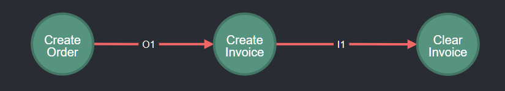

If we (manually) expand the result to show us the correlated objects, we obtain:

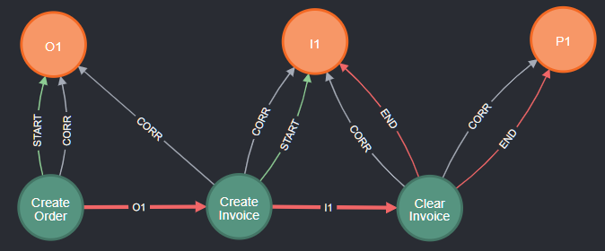

We can see that this trace indeed shows how the created order is invoiced and finally paid. Note that adding the object context is now relevant to better understand the behavior across different objects.

Also note that start and the end object are not directly related - but we nevertheless could query a path between them.

### 2.2 Multiple paths form a sub-graph: object-centric executions

While our query is retrieving a path between a start and an end-object, the actual behavior between two objects may be more involved than just a single path. For example, if we query for traces `WITH "A" AS start, "O1" AS end` we obtain the following sub-graph (with object nodes *A* and *O1* added manually for context):

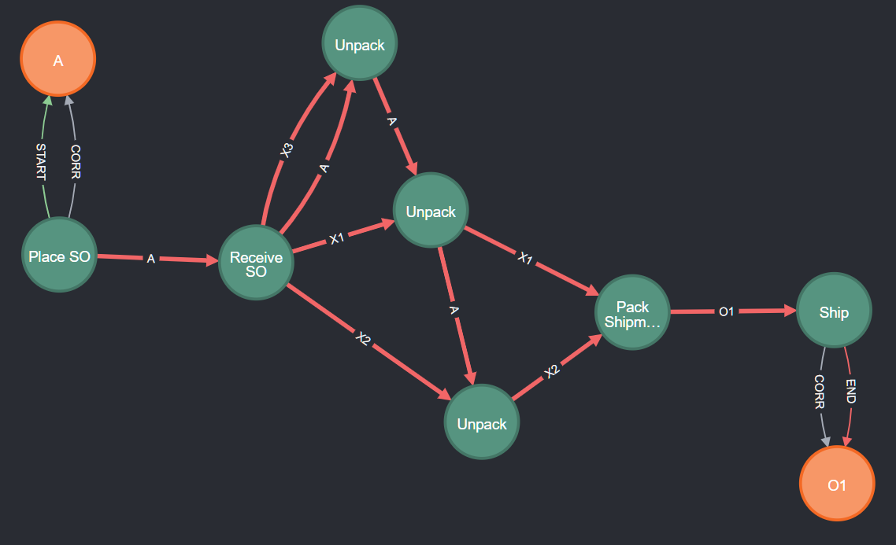

We can no longer call this a trace. Rather, it is a graph (or partial order) of events describing an **object-centric execution from a start object to an end object**, e.g., from *Supplier Order A* to *Order O1*. 

This execution describes how the items supplied to the inventory by *Supplier Order A* are subsequently used to fulfil *Order O1*. Note that the execution does contain events referring to objects that are *not* shipped by *O1* (e.g., *Item X3*) but which are nevertheless included in the behavior between *A* and *O1*.

Also note that querying such object-centric executions from an EKG does *not* require us to know *how* the different objects are related to each other. That information is encoded in the **:DF** relationships we inferred when constructing the EKG.

### 2.3 Materializing an object-centric execution for reference and re-use

Now that we know the basic concept of an object-centric execution as a sub-graph (or collection of paths) we can use it subsequently to analyze executions. In principle, we can chain queries using Cypher's `WITH` clause. 

However, it will be beneficial to **materialize** an execution of interest as a distinct node that refers to all involved events for faster querying and tracing analysis results. We can materialize an execution using the following query. This query
* first queries the paths of the execution as before
* then materializes the execution by
  * taking all events in the paths
  * and linking them to a new **:Execution** node

```
// Query execution from start object to end object and materialize as new node
WITH "A" AS start, "O1" AS end
MATCH (nStart:Entity {ID:start})<-[:START]-(eStart:Event)
MATCH (nEnd:Entity {ID:end})<-[:END]-(eEnd:Event)
MATCH p=(eStart)-[:DF*]->(eEnd)

// materialize execution
  // collect all unique events in the execution between start object/event and end object/event
  UNWIND nodes(p) AS event
  WITH DISTINCT nStart, nEnd, eStart, eEnd, event
  WITH nStart, nEnd, eStart, eEnd, collect(event) AS executionEvents

  // materialize execution for chosen start/end objects and events
  MERGE (nStart)-[:START]->(x:Execution {ID: nStart.ID+"_"+nEnd.ID})<-[:END]-(nEnd)
  MERGE (eStart)-[:START]->(x)<-[:END]-(eEnd)

  // link events to execution
  WITH x, executionEvents
  UNWIND executionEvents AS event
  MERGE (event)-[:CORR]->(x)
```

Let's look at the query in more detail. Each **object-centric start-to-end execution**
* is **parameterized by start and end points**, being
  * start and end objects *nStart* and *nEnd*
  * start event and end events *eStart* and *eEnd*
* and **consists of the set of *executionEvents* between these start/end nodes**:
  * we obtain these *executionEvents* by grouping (`collect(...)`) all `DISTINCT` events from the paths between the start/end nodes
  * then create a new **:Execution** node which
    * is correlated (**:CORR**) to all *executionEvents*
    * and marks **:START** and **:END** objects and events

*Note on Performance:* We use `MERGE` to ensure that the graph always contains only one **:Execution** node *x* describing an execution between *nStart* and *nEnd*. `MERGE` first checks whether the node to be created already exists in the graph and only creates it if it doesn't exist yet. This avoids creating multiple **:Execution** nodes if we run the same query multiple times which for example could happen when also query for collections of object-centric executions. The check for the existence of the **:Execution** node has a performance overhead. We can (almost) eliminate this performance overhead by **creating an index on the *:Execution* nodes** using `CREATE INDEX Execution_ID_index FOR (x:Execution) ON (x.ID)`.

To understand the resulting graph structure related to the **:Execution** node, we can use the following query. It retrieves the full execution from *A* to *O1* and all its associated nodes and relations.

```
// query execution node from A to O1 with all correlationed events
MATCH (nStart:Entity {ID:"A"}) -[starts:START]-> (x:Execution) <-[ends:END]- (nEnd:Entity {ID:"O1"})
  // query related events and DF relations in between
  MATCH (x:Execution)<-[c]-(e:Event)
  OPTIONAL MATCH (e)-[df:DF]->(e2:Event) WHERE (e2)-[:CORR]->(x)
RETURN x,c,e,df,e2,nStart,nEnd,starts,ends
```

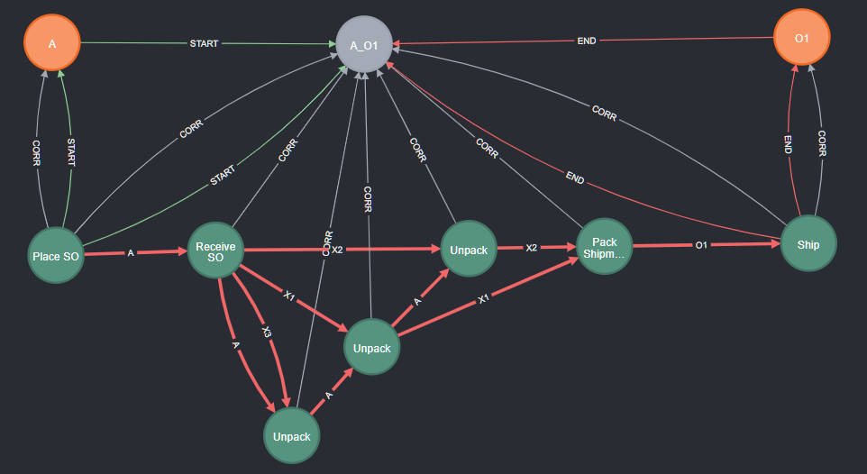

Gnerally, we will only be interested in the execution graph itself, i.e., the events and their DF relations related to the *:Execution* node, which we can retrieve with

```
// query graph of object-centric start-to-end execution from A to O1
MATCH (nStart:Entity {ID:"A"}) -[starts:START]-> (x:Execution) <-[ends:END]- (nEnd:Entity {ID:"O1"})
OPTIONAL MATCH (x)<-[:CORR]-(e:Event)-[df:DF]->(e2:Event) WHERE (e2)-[:CORR]->(x)
RETURN e,df,e2
```

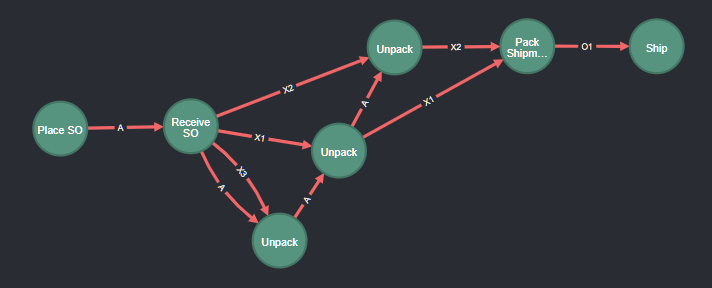

Altogether, this establishes a key capability for object-centric analysis: 
* to identify all behavior between two objects of interest
* to materialize the knowledge which events are part of this behavior as an **:Execution** node with **:CORR**elated **:Event** nodes

## 3. Querying & Materializing Multiple Object-Centric Executions

We are usually not interested in just a single execution, but in a ***collection* of multiple executions of the same kind** - so that we can summarize and compare them with each other.

In the following, we show how to query and materialize multiple similar executions. We do so by generalizing the previous queries from object identifiers to object types.

We illustrate this generalization for the example of executions from *Supplier Orders* to *Orders* because they describe the more general situation of *executions consisting of multiple DF-paths*.

Later, we review and look at the various object-centric executions in our example data.

### 3.1 Querying Object-Centric Executions by Object Types - Basic Idea

We start with the basic idea of lifting the queries to object types - which is actually quite simple.

Our queries so far 
* first matched a *start event of a start object* and an *end event of an end object* and
* then queried the paths of events from start event to end event

Instead of matching the start/end object by their *ID*-property, we can search for multiple start/end objects by their *EntityType* property. The following query does this:

```
// Query DF-paths from start object type to end object type 
WITH "Supplier Order" AS startType, "Order " AS endType
// get start event of object of the startType
MATCH (n1:Entity {EntityType:startType})<-[c1:START]-(e1:Event)
// get end event of object of endType
MATCH (eN:Event)-[cN:END]->(n2:Entity {EntityType:endType})
// get path from start event to end event
MATCH p=(e1)-[:DF*]->(eN)
RETURN p
```

Executing this query yields following graph (with the object-context added manually)

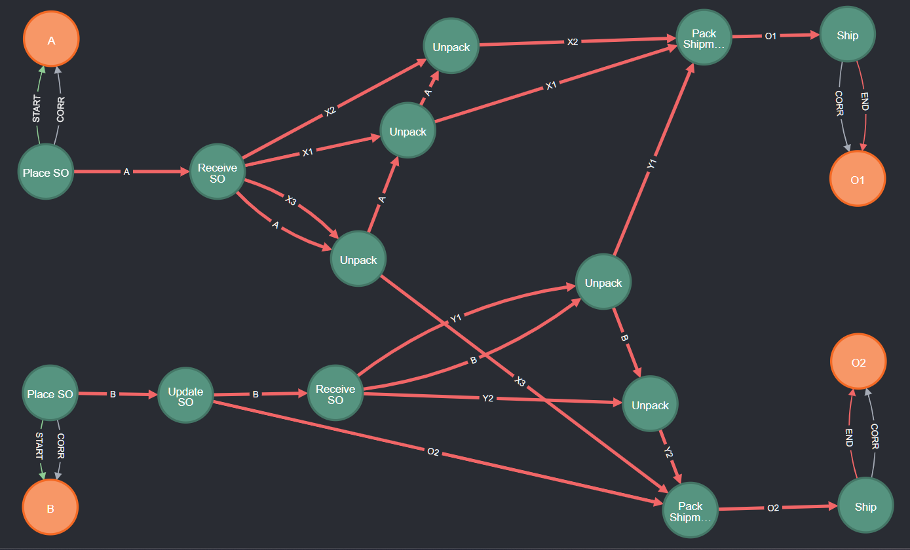

The graph shows 
* two start objects (*Supplier Orders* *A* and *B*);
* two end objects (*Orders* *O1* and *O2*);
* DF-paths between all start and end objects suggesting that the process has 4 distinct start-to-end executions
  * from *A* to *O1* (via *Items* *X1* and *X2*),
  * from *A* to *O2* (via *Item* *X3*),
  * from *B* to *O1* (via *Item* *Y1*),
  * from *B* to *O2* (via *Item* *Y2*); and
* that the different executions
  * each are graphs (not just sequences) as already discussed above, and
  * overlap by sharing events, e.g., *Place SO* and *Receive SO* are shared by both executions starting in *A*.

Below we discuss further how to interpret these different start-to-end executions. But first, we want to *materialize* the different exectuions

### 3.2 Materializing Multiple Object-Centric Executions based on Types of Start/End Objects

The above simple query retrieves all paths between start/end objects of chosen types. To actualy analyze the different executions, we have to group (and remmeber) which paths and which events belong to which execution.

For this, we generalize the previous query for materializing a start-to-end execution between two objects. AAs before, we now query for start and end objects by their *EntityType* instead of by their *ID*.

```
// Query exeuction from multiple start/end object of the same type and materialize each as new execution node
WITH "Supplier Order" AS startType, "Order" AS endType
MATCH (nStart:Entity {EntityType:startType})<-[:START]-(eStart:Event)
MATCH (nEnd:Entity {EntityType:endType})<-[:END]-(eEnd:Event)
MATCH p=(eStart)-[:DF*]->(eEnd)

// materialize execution
  // collect all unique events in the execution between start object/event and end object/event
  UNWIND nodes(p) AS event
  WITH DISTINCT nStart, nEnd, eStart, eEnd, event
  WITH nStart, nEnd, eStart, eEnd, collect(event) AS executionEvents

  // materialize execution for chosen start/end objects and events
  MERGE (nStart)-[:START]->(x:Execution {ID: nStart.ID+"_"+nEnd.ID})<-[:END]-(nEnd)
  MERGE (eStart)-[:START]->(x)<-[:END]-(eEnd)

  // link events to execution
  WITH x, executionEvents
  UNWIND executionEvents AS event
  MERGE (event)-[:CORR]->(x)
```

Note that the query for *materialize execution* actually remains as before. Because we `collect(event) AS executionEvents` per `DISTINCT` start object *nStart* and end object *nEnd*, we get for each unique *nStart*-*nEnd* object combination a unique collection of *executionEvents* for which we materialize a new **:Execution** node.

If we execute the above query for `"Supplier Order" AS startType, "Order" AS endType`, we obtain 4 **:Execution** nodes.

### 3.3 Viewing Multiple Object-Centric Executions

#### Execution nodes and their start/end points

We can view these Execution nodes and their related start/end objects and events with `MATCH (yStart)-[s:START]->(x:Execution)<-[e:END]-(yEnd) RETURN yStart,s,x,e,yEnd`:

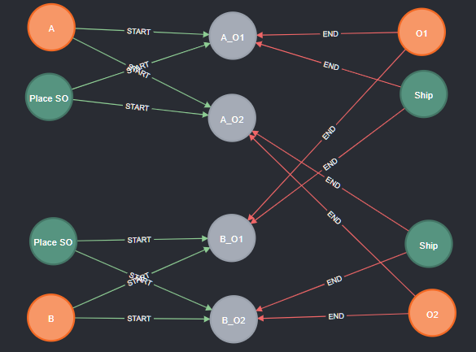

This graph confirms our earlier interpretation
* each *Supplier Order* has an execution to each of the *Orders* and vice versa, and 
* multiple executions overlap on shared events, espectially the start and end events.

#### Structure of overlapping start-to-end executions

Let us also have a look at how the Execution nodes group the underlying Event nodes and DF-relations into distinct, but overlapping executions. For the sake of readability, we only retrieve 2 executions, the ones which have *Order* *O1* as end object:

```
// query execution node from SupplierOrder to O1 with all correlationed events
WITH "Supplier Order" AS startType, "O1" AS endID
MATCH (nStart:Entity {EntityType:startType}) -[starts:START]-> (x:Execution) <-[ends:END]- (nEnd:Entity {ID:endID})
  // query related events and DF relations in between
  MATCH (x:Execution)<-[c]-(e:Event)
  OPTIONAL MATCH (e)-[df:DF]->(e2:Event) WHERE (e2)-[:CORR]->(x)
RETURN x,c,e,df,e2,nStart,nEnd,starts,ends
```

This query yields the following graph:

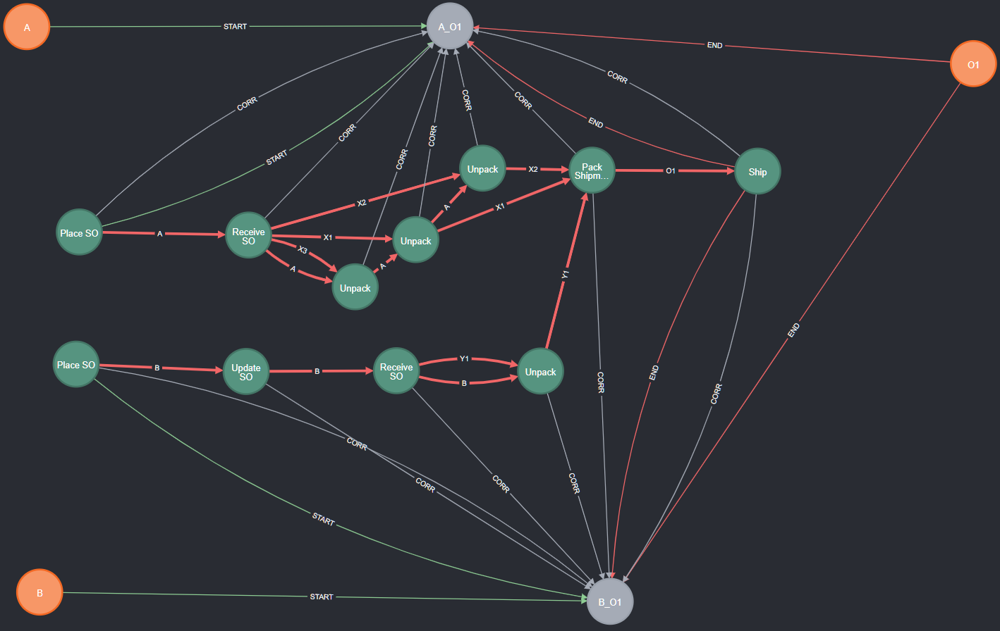

It shows
* two executions, from *A* to *O1* and from *B* to *O1*, and the events correlated to each of them
* the start/end objects and start/end events of each execution, showing that the executions share 
  * the same end object *O1* 
  * two events (*Pack Shipment* and *Ship*)
* the DF-paths between the start/end events of each execution, sharing a DF-edge from *Pack Shipment* to *Ship* for *O1*

#### All executions of a particular type

While the Execution nodes help us to correctly represent which events and DF-relations belong to a particular execution, we are usually not interested in visualizing them - but only the executions themselves.

To only retrieve the events and DF-relations of a particular type of execution, we can use the following query:

We can retrieve just the events and DF-relationships of all object-centric executions from *Supplier Orders* to *Orders* with

```
// Retrieve executions (events and DF-relations) between start/end objects of the same type
WITH "Supplier Order" AS startType, "Order" AS endType
MATCH (nStart:Entity {EntityType:startType}) -[starts:START]-> (x:Execution) <-[ends:END]- (nEnd:Entity {EntityType:endType})
OPTIONAL MATCH (x)<-[:CORR]-(e:Event)-[df:DF]->(e2:Event) WHERE (e2)-[:CORR]->(x)
RETURN e,df,e2
```

and obtain the following graph (with the object-context added manually)


With this, we now have all tools to
* query for start-to-end executions between object types
* materialize individual executions using Execution nodes
* visualize the structure of executions on the level entire executions and on the level of events and df-paths

### 4. Which object-centric executions are in the example data?

Let us apply all of the above queries for all *possible* start-to-end executions. Our aim is to 
* get an overview which kinds of start-to-end executions are contained in the data, and
* reflect on what information these provide to us.

Querying for all possible pairs of start/end object types would lead to approx. 90 start-to-end executions (primarily because every *Item* object is considered a possible start/end object). To obtain a simpler overview, we limit ourselves to start/end objects which have a *global* start/end event:
* A start event is a **global start event** if it has **no incoming *:DF* relationship at all**
* An end event is a **global end event** if it has **no outgoing *:DF* relationship at all**

```
// Query all executions between global start/end events of different objects
MATCH (nStart:Entity)<-[:START]-(eStart:Event) WHERE NOT ()-[:DF]->(eStart)
MATCH (nEnd:Entity)<-[:END]-(eEnd:Event)  WHERE NOT (eEnd)-[:DF]->() AND nEnd <> nStart
MATCH p=(eStart)-[:DF*]->(eEnd)

// materialize execution (same query as before, included for completeness)
  // collect all unique events in the execution between start object/event and end object/event
  UNWIND nodes(p) AS event
  WITH DISTINCT nStart, nEnd, eStart, eEnd, event
  WITH nStart, nEnd, eStart, eEnd, collect(event) AS executionEvents

  // materialize execution for chosen start/end objects and events
  MERGE (nStart)-[:START]->(x:Execution {ID: nStart.ID+"_"+nEnd.ID})<-[:END]-(nEnd)
  MERGE (eStart)-[:START]->(x)<-[:END]-(eEnd)

  // link events to execution
  WITH x, executionEvents
  UNWIND executionEvents AS event
  MERGE (event)-[:CORR]->(x)
```

This query yields 13 Executions which we can retrieve with `MATCH (yStart:Entity)-[s:START]->(x:Execution)<-[e:END]-(yEnd:Entity) RETURN yStart,s,x,e,yEnd` (not retrieving start/end events for readability):

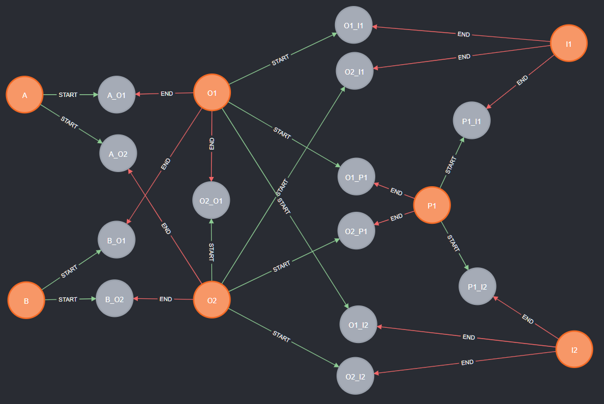

We see
1. (on the left) the already known structure of 4 executions from *Supplier Orders* (*A* and *B*) to *Orders* (*O1* and *O2*),
2. (on the right) 2 executions from *Orders* to *Payments* (both executions end with the same payment *P1*),
3. 4 executions from *Orders* (*O1* and *O2*) to *Invoices* (*I1* and *I2*),
4. 2 executions from *Payments* (the same payment) to *Invoices*, and
5. (in the middle) 1 execution from *O2* to *O1*
6. that **there is no execution**
  * from *Order* to *Supplier Order*
  * from *Supplier Order* to *Payment* or to *Invoice*

In the following we look at each of these and (try to) interpret them.

#### 4.1 *Supplier Orders* to *Orders*

We retrieve the executions with 

```
// Retrieve executions (events and DF-relations) between start/end objects of the same type
WITH "Supplier Order" AS startType, "Order" AS endType
MATCH (nStart:Entity {EntityType:startType}) -[starts:START]-> (x:Execution) <-[ends:END]- (nEnd:Entity {EntityType:endType})
OPTIONAL MATCH (x)<-[:CORR]-(e:Event)-[df:DF]->(e2:Event) WHERE (e2)-[:CORR]->(x)
RETURN e,df,e2
```

and obtain the already previously shown graph


We can indeed see how the items provided by through the *Supplier Orders* are later used to fulfil and ship *Orders*. Note that we do not see the full *Order* traces but only the part of each *Order* trace that is influenced or impacted by the *Supplier Orders*. And we also see that each *Order* depends on items from two different *Supplier Orders*. Furthermore, we do see that all executions have generally the same structure (*Place SO*, *Receive SO*, *Unpack* a number of items, *Pack Shipment* and *Ship*).

#### 4.2 *Orders* to *Payments* 

We retrieve the executions with 

```
// Retrieve executions (events and DF-relations) between start/end objects of the same type
WITH "Order" AS startType, "Payment" AS endType
MATCH (nStart:Entity {EntityType:startType}) -[starts:START]-> (x:Execution) <-[ends:END]- (nEnd:Entity {EntityType:endType})
OPTIONAL MATCH (x)<-[:CORR]-(e:Event)-[df:DF]->(e2:Event) WHERE (e2)-[:CORR]->(x)
RETURN e,df,e2
```

and obtain the following graph (with object context added):

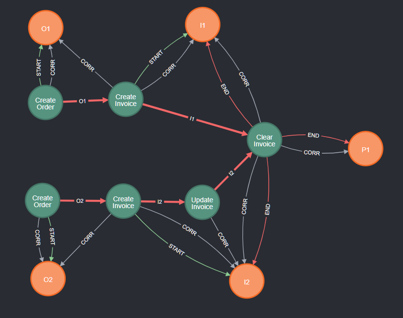


We see that *all orders*, i.e., orders *O1* and *O2*, are settled by the *same* payment *P1*. We also see their executions differ as the intermediate invoices *I1* and *I2* are handled differently: *I2* has an additional *Update Invoice* event.

#### 4.3 *Orders* to *Invoices*

Using `WITH "Order" AS startType, "Invoice" AS endType` in the above queries yields exactly the same exectution graphs and insights as querying `WITH "Order" AS startType, "Payment" AS endType`. The reason is that *Payments* and *Invoices* share the same end event *Clear Invoice*

#### 4.4 *Payments* to *Invoices*

We retrieve the executions with 

```
// Retrieve executions (events and DF-relations) between start/end objects of the same type
WITH "Payment" AS startType, "Invoice" AS endType
MATCH (nStart:Entity {EntityType:startType}) -[starts:START]-> (x:Execution) <-[ends:END]- (nEnd:Entity {EntityType:endType})
OPTIONAL MATCH (x)<-[:CORR]-(e:Event)-[df:DF]->(e2:Event) WHERE (e2)-[:CORR]->(x)
RETURN e,df,e2
```

and obtain the following graph (with object context added):

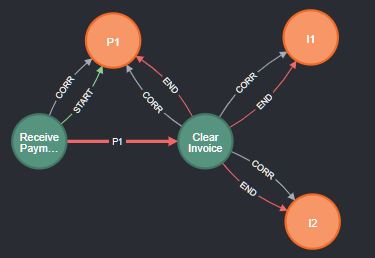

The retrieved graph of 2 executions (from *P1* to *I1* and from *P1* to *I2*) is the object-trace for *Payment* *P1* which indeed starts on its own (with *Receive Payment*) and ends both invoices and the payment.

#### 4.5 *Orders* to *Orders*

We retrieve the executions with 

```
// Retrieve executions (events and DF-relations) between start/end objects of the same type
WITH "Order" AS startType, "Order" AS endType
MATCH (nStart:Entity {EntityType:startType}) -[starts:START]-> (x:Execution) <-[ends:END]- (nEnd:Entity {EntityType:endType})
OPTIONAL MATCH (x)<-[:CORR]-(e:Event)-[df:DF]->(e2:Event) WHERE (e2)-[:CORR]->(x)
RETURN e,df,e2
```

and obtain the following graph (with object context added):

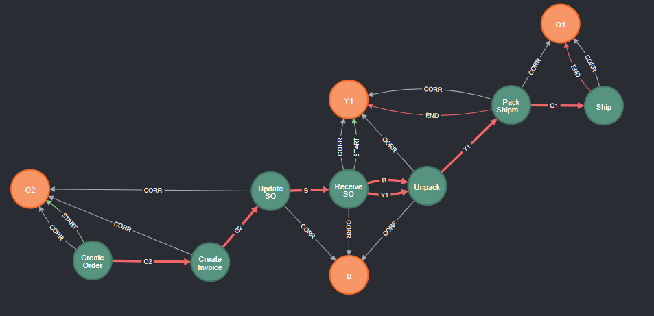

It is unusual to find executions between different objects of the same type. However, in the example data, *Order* *O2* synchronized with *Supplier Order* *B2* in the *Update SO* event. As a result, an execution from *O2* to *O1* forms that consists of two parts
* from *Create Order* at *O2* to *Update SO* at *B* and
* from *Update SO* at *B* to *Ship* at *O1* - which largely overlaps with the execution from *B$* to *O1* we already observed above.

This execution clearly is an **outlier* compared to all other executions we found and reveals a suprising dependency between *O2* and *O1* due to the *Update SO* event which can also be seen as undesired.

#### 4.6 Absence of Executions between ...

We have not found any executions
  * from *Order* to *Supplier Order*,
  * from *Supplier Order* to *Payment* or to *Invoice*, and
  * between any objects of the same type (except for *O2* to *O1* discussed above).

This suggests that 
* *Supplier Orders* are indeed created and managed independently from *Orders*, i.e., there is no directly recorded control-flow dependency between incoming *Orders* and replenishing the inventory through *Supplier Orders*;
* inventory replenishment through *Supplier Orders* is independent of and unrelated to the financial transactions related to the orders (i.e., *Invoices* and *Payments*);
* different *Supplier Orders* are independendent of each other; and
* different *Invoices* are independent of each other.


## 5 Wrap-Up

This tutorial 
  * introduced the concept of an **object-centric start-to-end execution** as a generalization of the case concepts to the object-centric setting
  * showed how to query such executions by choosing start- and end-points - by exploiting **:DF** across various objects
  * showed how to materialize executions by enriching the graph with **:Execution** nodes
  * showed how to **query and interpret all start-to-end executions** in an EKG.

In two **follow-up tutorials** we explore how to
*  [Summarize and Analyze Object-Centric Process Executions](./tutorial-ocpm-object-centric-process-executions-summarizing.md)
* [Define and Query other Forms of Object-Centric Process Executions](./tutorial-ocpm-object-centric-process-executions-generalized.md)