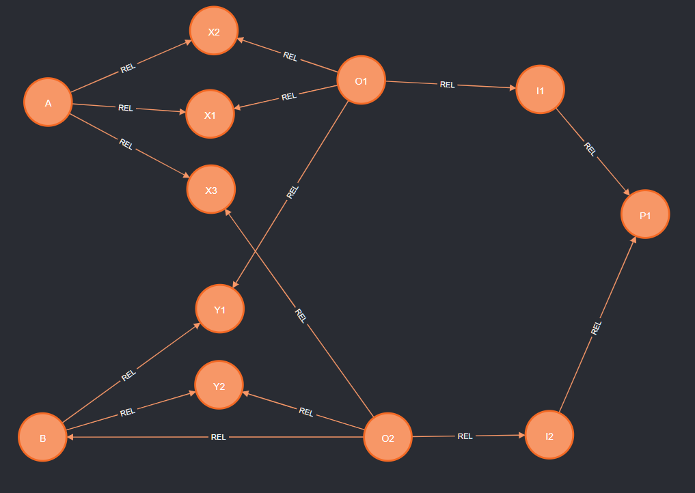
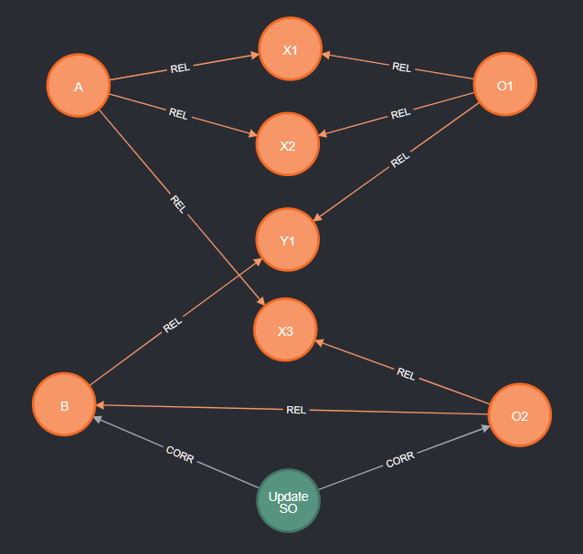
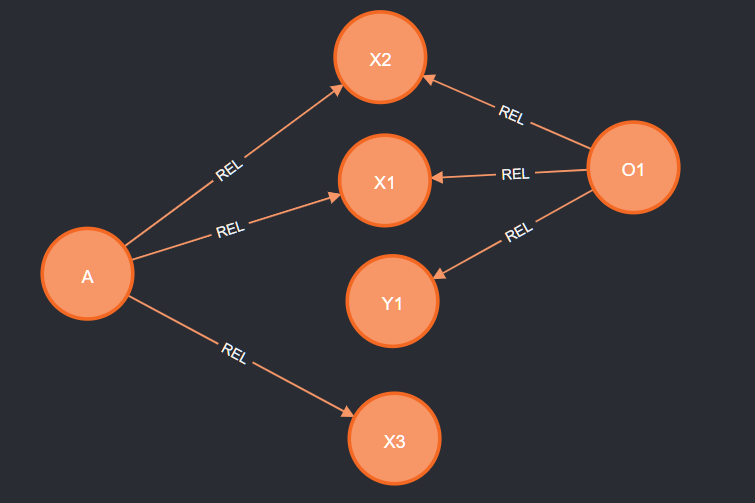
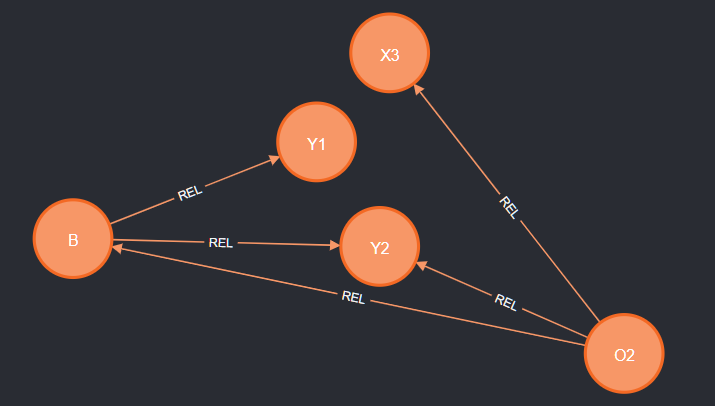
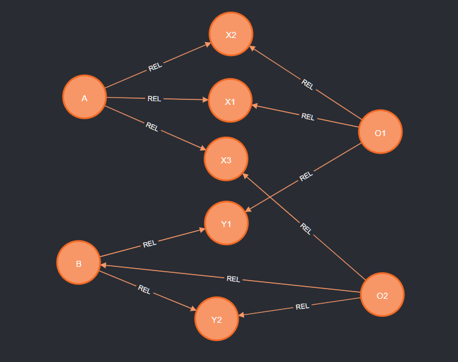

# Tutorial OCPM 3: Defining and Analyzing Object-Centric Process Executions

This tutorial is part of a series of tutorials for realizing Object-Centric Process Mining (OCPM) with Event Knowledge Graphs (EKGs).

This tutorial explains advanced queries for analyzing the behavior in an EKG. We cover
  * How to generalize the concept of a trace from an object to a set of related objects: [Section 2](#2-generalizing-object-traces-to-object-centric-executions)
  * How to generalize the concept of a trace to a sub-graph of an **object-centric start-to-end execution** involving multiple objects: [Section 2](#2-generalizing-object-traces-to-object-centric-executions)
  * How to query for and store information about multiple start-to-end executions of the same kind: [Section 3](#3-querying--materializing-multiple-object-centric-executions)
  * How to define and query for various forms of start-to-end executions: [Section 4](#4-choosing-other-start-and-end-points-for-object-centric-executions)
  * How to summarize start-to-end executions as a **simple form of object-centric trace variants**: [Section 5](#5-summarizing-object-centric-executions)
  * How to **model object-centric executions on the level of objects**: [Section 6](#6-object-centric-executions-on-the-level-of-objects)
  * How to to use all of the above to generate **a global object-centric summary of an entire EKG**: [Section 7](#7-global-summary-using-global-start-and-end-events)


## 0. Prerequisites

  * You have completed the [the tutorial on building event knowledge graphs](./tutorial-your-first-event-knowledge-graph.md)
     * You have a running instance of Neo4j
     * You have imported events and constructed an EKG
  * You have completed the [OCPM tutorial on inferring relations between objects](./tutorial-ocpm-relations.md)
  * You have completed the [OCPM tutorial on analyzing object traces](./tutorial-ocpm-object-traces.md)

## 1. Current EKG

Through the [tutorial](./tutorial-your-first-event-knowledge-graph.md) you should have constructed the following EKG 


It contains following types of nodes
  * **:Event** nodes describing occurrences of an activity at a particular point in time, furter described by various properties
  * **:Entity** nodes describing the process objects and other entities in the process
  * **:CORR** (correlation) relationships where  `(e:Event) -[:CORR]-> (n:Entity)` states that event *e* refers to entity *n*
  * **:DF** (directly-follows) relationships where `(e1:Event) -[:DF { ID:"o1" }]-> (e2:Event)` states that event *e1* is directly followed by event *e2* from the perspective of an entity *n* with `n.ID=o1`

### 1.1 Event Layer of the EKG

Querying only for events and df-relations with `match (e1:Event)-[df:DF]->(e2:Event) return e1,df,e2` shows us this **behavioral part** of the EKG


It describes the process execution in an object-centric way, ordering events not wrt. to a global case identifier but wrt. the individual objects the events are correlated to. See also the Open Access Book Chapter [Process Mining over Multiple Behavioral Dimensions with Event Knowledge Graphs](https://link.springer.com/chapter/10.1007/978-3-031-08848-3_9).

### 1.2 Object Layer of the EKG

We can query the object part of the EKG using
```
MATCH (n:Entity)
OPTIONAL MATCH (n:Entity)-[r]-(n2:Entity)
RETURN n,r,n2
```
which returns all :Entity nodes and (optionally) all relations between :Entity nodes. Doing so on this EKG returns the **object part** of the EKG.


## 2. Generalizing Object Traces to Object-Centric Executions

The [OCPM tutorial on analyzing object traces](./tutorial-ocpm-object-traces.md) uses the following query to retrieve the trace of an individual object. Recall, that as part of this tutorial we inferred the **:START** and **:END** relationships to materialize knowledge about the start and end events of an object.

```
// Query trace (directly-follows path) of a specific object (or entity) identified by 'objId'
WITH "O1" as objId
// retrieve start and end events
MATCH (e1:Event)-[:START]->(n:Entity {ID:objId})<-[:END]-(eN:Event)
// retrieve path from start to end event, along all DF relationships referring to objects identifier
MATCH p=(e1)-[:DF* {ID:n.ID}]->(eN)
// return the entire path
RETURN p
```

While querying for object traces gives us insights into the behavior of all objects individually, the traces of different objects synchronize in events that are related to multiple objects. As a result, the behavior in an object-centric process goes beyond a single object. 

To analyze such behavior the spans across multiple objects, we have to change our definition of a trace and how to query it.

A trace of a classical case and an object trace is a sequence or path of events that
* begins at the start event of the object/case,
* ends at the end event of the object/case, and
* contains only the events of the object/case between start and end.

Going beyond single objects, we can define a **general trace** as a sequence or path of events that
* begins at some starting event, for example the start event of some "start object",
* end at some ending event, for example the end event of some "end object", and
* contains only the events between start and end.

We will quickly see that the 3rd condition has quite some room for interpretation. However, to get started let us take a simple interpretation of "a (shortest) path from start to end".

### 2.1 Querying a path between a start object and an end object

We easily adapt the trace object query to a query that retrieves a general trace between a start object, say *Order O1* which can be seen as the beginning of the order process, and an end object, say Payment *P1* which can be seen as the conclusion of the order process:

```
// Query trace from start object to end object 
WITH "O1" AS start, "P1" AS end
// get start event of start object
MATCH (nStart:Entity {ID:start})<-[:START]-(eStart:Event)
// get end event of end object
MATCH (nEnd:Entity {ID:end})<-[:END]-(eEnd:Event)
// get path from start event to end event over any :DF relation
MATCH p=(eStart)-[:DF*]->(eEnd)
RETURN p
```

Note that we know query a path `MATCH p=(eStart)-[:DF*]->(eEnd)` over **:DF relations of any object** as we are now searching for traces across objects. Executing this query returns the following trace.


If we (manually) expand the result to show us the correlated objects, we obtain:


We can see that this trace indeed shows how the created order is invoiced and finally paid. Note that adding the object context is now relevant to better understand the behavior across different objects.

Also note that start and the end object are not directly related - but we nevertheless could query a path between them.

### 2.2 Multiple paths form a sub-graph: object-centric executions

While our query is retrieving a path between a start and an end-object, the actual behavior between two objects may be more involved than just a single path. For example, if we query for traces `WITH "A" AS start, "O1" AS end` we obtain the following sub-graph (with object nodes *A* and *O1* added manually for context):


We can no longer call this a trace. Rather, it is a graph (or partial order) of events describing an **object-centric execution from a start object to an end object**, e.g., from *Supplier Order A* to *Order O1*. 

This execution describes how the items supplied to the inventory by *Supplier Order A* are subsequently used to fulfil *Order O1*. Note that the execution does contain events referring to objects that are *not* shipped by *O1* (e.g., *Item X3*) but which are nevertheless included in the behavior between *A* and *O1*.

Also note that querying such object-centric executions from an EKG does *not* require us to know *how* the different objects are related to each other. That information is encoded in the **:DF** relationships we inferred when constructing the EKG.

### 2.3 Materializing an object-centric execution for reference and re-use

Now that we know the basic concept of an object-centric execution as a sub-graph (or collection of paths) we can use it subsequently to analyze executions. In principle, we can chain queries using Cypher's `WITH` clause. 

However, it will be beneficial to **materialize** an execution of interest as a distinct node that refers to all involved events for faster querying and tracing analysis results. We can materialize an execution using the following query. This query
* first queries the paths of the execution as before
* then materializes the execution by
  * taking all events in the paths
  * and linking them to a new **:Execution** node

```
// Query execution from start object to end object and materialize as new node
WITH "A" AS start, "O1" AS end
MATCH (nStart:Entity {ID:start})<-[:START]-(eStart:Event)
MATCH (nEnd:Entity {ID:end})<-[:END]-(eEnd:Event)
MATCH p=(eStart)-[:DF*]->(eEnd)

// materialize execution
  // collect all unique events in the execution between start object/event and end object/event
  UNWIND nodes(p) AS event
  WITH DISTINCT nStart, nEnd, eStart, eEnd, event
  WITH nStart, nEnd, eStart, eEnd, collect(event) AS executionEvents

  // materialize execution for chosen start/end objects and events
  MERGE (nStart)-[:START]->(x:Execution {ID: nStart.ID+"_"+nEnd.ID})<-[:END]-(nEnd)
  MERGE (eStart)-[:START]->(x)<-[:END]-(eEnd)

  // link events to execution
  WITH x, executionEvents
  UNWIND executionEvents AS event
  MERGE (event)-[:CORR]->(x)
```

Let's look at the query in more detail. Each **object-centric start-to-end execution**
* is **parmeterized by start and end points**, being
  * start and end objects *nStart* and *nEnd*
  * start event and end events *eStart* and *eEnd*
* and **consists of the set of *executionEvents* between these start/end nodes**:
  * we obtain these event by grouping (`collect(...)`) all `DISTINCT` events from the paths between the start/end nodes
  * then create a new **:Execution** node which
    * is correlated (**:CORR**) to all *executionEvents*
    * and marks **:START** and **:END** objects and events

To understand the resulting graph structure, we can use the following query to retreieve the full execution from *A* to *O1* and all its associated nodes and relations.

```
// query execution node from A to O1 will all correlationed events
MATCH (nStart:Entity {ID:"A"}) -[starts:START]-> (x:Execution) <-[ends:END]- (nEnd:Entity {ID:"O1"})
MATCH (x:Execution)<-[c]-(e:Event)
OPTIONAL MATCH (e)-[df:DF]->(e2:Event) WHERE (e2)-[:CORR]->(x)
RETURN x,c,e,df,e2,nStart,nEnd,starts,ends
```


Though, in most cases, we are only interested in the execution graph itself, i.e., the events and their DF relations, which we can retrieve with

```
// query graph of object-centric start-to-end execution from A to O1
MATCH (nStart:Entity {ID:"A"}) -[starts:START]-> (x:Execution) <-[ends:END]- (nEnd:Entity {ID:"O1"})
OPTIONAL MATCH (x)<-[:CORR]-(e:Event)-[df:DF]->(e2:Event) WHERE (e2)-[:CORR]->(x)
RETURN e,df,e2
```


Note that we use `MERGE` to ensure that the graph always contains only one **:Execution** node *x* describing an execution between *nStart* and *nEnd*. `MERGE` first checks whether the node to be created already exists in the graph and only creates it if it doesn't exist yet. This avoids creating multiple **:Execution** nodes if we run the same query multiple times which for example could happen when also query for collections of object-centric executions. The check for the existence of the **:Execution** node has a performance overhead. We can (almost) eliminate this performance overhead by **creating an index on the *:Execution* nodes** using `CREATE INDEX Execution_ID_index FOR (x:Execution) ON (x.ID)`.

Altogether, this establishes a key capability for object-centric analysis: 
* to identify all behavior between two objects of interest
* to materialize the knowledge which events are part of this behavior as an **:Execution** node with **:CORR**elated **:Event** nodes

## 3. Querying & Materializing Multiple Object-Centric Executions

We are usually interested in collections of similar behavior, e.g., to summarize the data and to identify outliers. 

We can easily generalize from querying an execution between a single start object (*Order O1*) and a single end object (*Payment P1*) to querying all executions between a single start object of a particular type (any *Order*) and a single end object of a particular type (any *Payment*).

We show how to do this and also how to materialize the result as distinct executions.

### 3.1 Querying Executions based on Start/End Object Types 

The following query queries for all executions between any *Order* and any *Payment* (without materializing the execution):

```
// Query paths from start object type to end object type 
WITH "Order" AS startType, "Payment" AS endType
// get start event of object of the startType
MATCH (n1:Entity {EntityType:startType})<-[c1:START]-(e1:Event)
// get end event of object of endType
MATCH (eN:Event)-[cN:END]->(n2:Entity {EntityType:endType})
// get path from start event to end event
MATCH p=(e1)-[:DF*]->(eN)
RETURN p
```

Executing this query (and adding the object context) reveals the following two paths which show that all (both) orders *O1* and *O2* are settled by the same payment *P1* yet their traces differ as the intermediate invoices *I1* and *I2* are handled differently. 


While the traces from Orders to Payment only describe a small part of the data - they *do* describe a distinct and relevant **start-to-end dynamics of the process**: how *Orders* are concluded in *Payments*.

What is a meaningful start-to-end dynamic depends on the process and the semantics of the objects; such information is not encoded in the EKG. In our example, relevant dynamics could for example be to understand how
* *Supplier Orders* end in *Payments* (Are there any relations between extending the process inventory and payments?)
* *Supplier Orders* (extending the process inventory) end in *Orders* (usage of the inventory for order fulfilment)


### 3.2 Detecting that Two Object Types have No Connecting Executions

Running the above query with `"Supplier Order" as startType` and `"Payment" as endType` returns 0 paths as there simply is no behavior that connects a *Supplier Order* to a *Payment*. Such insights are also relevant in the context of process monitoring and conformance checking, i.e., when we are interested in whether a process deviates from expected behavior.

### 3.3 Materializing Multiple Object-Centric Executions of the Same Kind

So far, we only queried collections of executions that consisted of a single path or no path. But we do know (from eariler queries) that the object-centric execution from *Supplier Order A* to *Order O1* consists of multiple paths. If we want query all executions from *Supplier Orders* to *Orders*, then we have to remember which paths belong to which execution.

To do so, we combine querying "paths from start object type to end object type" with the query to "materialize an execution".  

```
// Query exeuction from multiple start/end object of the same type and materialize each as new execution node
WITH "Supplier Order" AS startType, "Order" AS endType
MATCH (nStart:Entity {EntityType:startType})<-[:START]-(eStart:Event)
MATCH (nEnd:Entity {EntityType:endType})<-[:END]-(eEnd:Event)
MATCH p=(eStart)-[:DF*]->(eEnd)

// materialize execution
  // collect all unique events in the execution between start object/event and end object/event
  UNWIND nodes(p) AS event
  WITH DISTINCT nStart, nEnd, eStart, eEnd, event
  WITH nStart, nEnd, eStart, eEnd, collect(event) AS executionEvents

  // materialize execution for chosen start/end objects and events
  MERGE (nStart)-[:START]->(x:Execution {ID: nStart.ID+"_"+nEnd.ID})<-[:END]-(nEnd)
  MERGE (eStart)-[:START]->(x)<-[:END]-(eEnd)

  // link events to execution
  WITH x, executionEvents
  UNWIND executionEvents AS event
  MERGE (event)-[:CORR]->(x)
```

Note that the query for *materialize execution* remains as before. By `collect(event) AS executionEvents` per start object *nStart* and end object *nEnd*, we get for each unique *nStart*-*nEnd* combination a unique collection of *executionEvents* for which we materialize a new **:Execution** node.

If we execute the above query, we obtain 4 **:Execution** nodes with the following related start/end objects and events (retrieved with `MATCH (yStart)-[s:START]->(x:Execution)<-[e:END]-(yEnd) RETURN yStart,s,x,e,yEnd`):


We can see that each *Supplier Order* has an execution to each of the *Orders* and vice versa.

We can query for the events and relationships in these object-centric executions from *Supplier Orders* to *Orders* with

```
MATCH (nStart:Entity {EntityType:"Supplier Order"}) -[starts:START]-> (x:Execution) <-[ends:END]- (nEnd:Entity {EntityType:"Order"})
OPTIONAL MATCH (x)<-[:CORR]-(e:Event)-[df:DF]->(e2:Event) WHERE (e2)-[:CORR]->(x)
RETURN e,df,e2
```

and obtain the following graph (with the object-context added manually)


We can indeed see how the inventory filled up through *Supplier Orders* is later used to fulfil and ship *Orders*. Note that we do not see the full *Order* traces but only the part of the *Order* trace that is influenced or impacted by the *Supplier Orders*. And we also see that each *Order* depends on items from two different *Supplier Orders*. 


## 4 Choosing Other Start and End points for object-centric executions

Our query for retrieving an object-centric execution determines an **object-centric execution** as 
* a collection of paths between 
* a single start event *eStart* being the start event of a chosen "start object" *nStart*
* a single end event *eEnd* being the end event of a chosen "end object" *nEnd*

However, we can make different choices regarding
* how to pick start/end events
* how many start/end events to pick

### 4.1 Single start and single end by activity of specific object

So far, we always picked the start event of the start object to also be the start event of the execution; likewise for the end event. We can also choose the *start event* and the *end event* of the object-centric execution to be given by
* a start object ID + a start activity name
* an end object ID + an end activity name

For example, we can query for executions from *Receive SO* of *Supplier Order A* until *Pack Shipment* of *Order O1*:

```
// Query execution from start object + start activity to end object + end activity
WITH "A" AS startID, "Receive SO" AS startAct, "O1" AS endID, "Pack Shipment" AS endAct
// get start event of start object
MATCH (nStart:Entity {ID:startID})<-[:CORR]-(eStart:Event {Activity: startAct})
// get end event of end object
MATCH (nEnd:Entity {ID:endID})<-[:CORR]-(eEnd:Event {Activity:endAct})
// get path from start event to end event over any :DF relation
MATCH p=(eStart)-[:DF*]->(eEnd)
RETURN p
```

The resulting object-centric execution is shorter than the full execution from the start of *A* to the end of *O1*.


### 4.2 Choose start OR end event just by activity

We can also choose the execution to 
* only have a fixed single start event (such as the start event of a start object) 
* while letting *any* end event of some object by the end event of the execution

For example the following query retrieves the execution that starts with *Receive SO* in *Supplier Order A* and ends anywhere:

```
// Query execution from start object + start activity to end object + end activity
WITH "A" AS startID, "Receive SO" AS startAct
// get start event of start object
MATCH (nStart:Entity {ID:startID})<-[:CORR]-(eStart:Event {Activity: startAct})
// get end event of any possible end object
MATCH (nEnd:Entity)<-[:END]-(eEnd:Event)
// get path from start event to end event over any :DF relation
MATCH p=(eStart)-[:DF*]->(eEnd)
RETURN p
```

This query yields the following "(single) start-to-(multiple) ends execution"


It shows the full process of how *all* them *Items* from this supplier order are handled until shipment. We can see that
* *X1* and *X3* end up in *O1* while
* *X3* ends up in *O2*, and
* there are no other dynamics in the entire process that this supplier order impacts (simply by absence of any other events reachable from the chosen start event).

## 5 Summarizing object-centric executions

Getting an overview over all object-centric executions requries to create summaries. We here explore two ideas. One based on summarizing the execution's events into trace variants and one based on summarizing the involved objects.

### 5.1 An attempt at a trace variant: mapping paths of an object-centric executions to activities

As object-centric executions are collections of paths, we can try to adapt the idea of object trace variants from the [OCPM Tutorial on Object Traces](./tutorial-ocpm-object-traces.md). We simply map each queried path between a start and an end object to the sequence of activities. For example:

```
WITH "Supplier Order" AS startType, "Order" AS endType
// Query all paths between objects of startType and endType
MATCH (nStart:Entity {EntityType:startType})<-[c1:START]-(e1:Event)
MATCH (eN:Event)-[cN:END]->(nEnd:Entity {EntityType:endType})
MATCH p=(e1)-[:DF*]->(eN)
// Map each event path between a start object and end object to its activities
RETURN nStart.ID, nEnd.ID AS end, [event IN nodes(p) | event.Activity] AS trace
```

However, the result contains a lot of traces between the same two objects and several duplicates:

| nStart.ID | nEnd.ID  | trace |
|-----------|----------|-------|
| "A"	| "O1" | ["Place SO", "Receive SO", "Unpack", "Pack Shipment", "Ship"] |
| "A"	| "O1" | ["Place SO", "Receive SO", "Unpack", "Unpack", "Unpack", "Pack Shipment", "Ship"] |
| "A"	| "O1" | ["Place SO", "Receive SO", "Unpack", "Unpack", "Unpack", "Pack Shipment", "Ship"] |
| "A"	| "O1" | ["Place SO", "Receive SO", "Unpack", "Unpack", "Pack Shipment", "Ship"] |
| "A"	| "O1" | ["Place SO", "Receive SO", "Unpack", "Unpack", "Pack Shipment", "Ship"] |
| "A"	| "O1" | ["Place SO", "Receive SO", "Unpack", "Unpack", "Pack Shipment", "Ship"] |
| "A"	| "O1" | ["Place SO", "Receive SO", "Unpack", "Pack Shipment", "Ship"] |
|   |    |    |
| "B"	| "O1" | ["Place SO", "Update SO", "Receive SO", "Unpack", "Pack Shipment", "Ship"] |
| "B"	| "O1" | ["Place SO", "Update SO", "Receive SO", "Unpack", "Pack Shipment", "Ship"] |
|   |    |    |
| "A"	| "O2" | ["Place SO", "Receive SO", "Unpack", "Pack Shipment", "Ship"] |
| "A"	| "O2" | ["Place SO", "Receive SO", "Unpack", "Pack Shipment", "Ship"] |
|   |    |    |
| "B"	| "O2" | ["Place SO", "Update SO", "Receive SO", "Unpack", "Unpack", "Pack Shipment", "Ship"] |
| "B"	| "O2" | ["Place SO", "Update SO", "Receive SO", "Unpack", "Unpack", "Pack Shipment", "Ship"] |
| "B"	| "O2" | ["Place SO", "Update SO", "Receive SO", "Unpack", "Pack Shipment", "Ship"] |
| "B"	| "O2" | ["Place SO", "Update SO", "Pack Shipment", "Ship"] |

If we compare this with the graph of the execution shown above, we can see that indeed each of these traces has a corresponding path in the EKG as we find parallel **:DF** edges and also multiple paths between intermediate event nodes in the EKG. However, we would like less redundancy in our summary.

### 5.2 Start-to-End Trace Variant Option 1: each unique activity path

One possibility is to remove all duplicate start-to-end trace variants in the result set (by using `DISTINCT` when mapping path *p* to *trace*) and subsequently collecting all trace variants between the same two objects.

```
WITH "Supplier Order" AS startType, "Order" AS endType
// Query all paths between objects of startType and endType
MATCH (nStart:Entity {EntityType:startType})<-[c1:START]-(e1:Event)
MATCH (eN:Event)-[cN:END]->(nEnd:Entity {EntityType:endType})
MATCH p=(e1)-[:DF*]->(eN)
// Map each unique event path between a start object and end object to its activities
WITH DISTINCT nStart, nEnd, [event IN nodes(p) | event.Activity] AS trace
// collect all trace variants between the same objects
RETURN DISTINCT nStart.ID, nEnd.ID, collect(trace) AS variants
```

This results in the following trace variants:

| nStart.ID | nEnd.ID | variants |
|-----------|---------|------------|
| "A" | "O1" | [["Place SO", "Receive SO", "Unpack", "Pack Shipment", "Ship"], |
|     |      | ["Place SO", "Receive SO", "Unpack", "Unpack", "Unpack", "Pack Shipment", "Ship"], |
|     |      | ["Place SO", "Receive SO", "Unpack", "Unpack", "Pack Shipment", "Ship"]] |
| "B" | "O1" | [["Place SO", "Update SO", "Receive SO", "Unpack", "Pack Shipment", "Ship"]] |
| "A" | "O2" | [["Place SO", "Receive SO", "Unpack", "Pack Shipment", "Ship"]] |
| "B" | "O2" | [["Place SO", "Update SO", "Receive SO", "Unpack", "Unpack", "Pack Shipment", "Ship"], |
|     |      | ["Place SO", "Update SO", "Receive SO", "Unpack", "Pack Shipment", "Ship"], |
|     |      | ["Place SO", "Update SO", "Pack Shipment", "Ship"]] |

This result looks unusual and complex at the first glance as we may now have multiple start-to-end trace variants between two objects. However, these individual variants do have a valid interpretation:
* *B* to *O1* only has one trace variant (i.e. one path) from *B* to *O1* as there is only one other object (*Item Y1*) involved in this trace.
* *A* to *O2* likewise
* *A* to *A1* has three trace variants as there are three principle paths from *A* to *O1* (see the graph-based visualiation of the start-to-end execution above), each involving a distinct *other* object:
  * the path via *X1* (*Receive*, *Unpack*, and *Pack...* *X1*)
  * the path via *X2* (*Receive*, *Unpack*, and *Pack...* *X2*)
  * the path via the first *Unpack* event relating to *X3* that the Supplier Order *A* also hsa to go through before *X1* and *X2* can be unpacked.
* *B* to *O2* likewise

Arguably, these paths are not always obvious to interpret, they these trace variants to encode distinct characteristics of each start-to-end execution.

### 5.3 Start-to-End Trace Variant Option 2: global activity sequence

Another possiblity is to simply aggregate all behavior between two objects into a single feature, i.e., a single event sequence between two objects. The following query first gathers all events found in a path between the same start and end objects, removes all duplicates and orders them by time. This results in an event sequence of all the events in the object-centric execution, i.e., a classical trace from the start object to the end object. This event sequence is then mapped to an activity sequence.

```
// Query totally ordered activity sequence between objets of srcType and tgtType
WITH "Supplier Order" AS startType, "Order" AS endType
// query all traces between objects of startType and objects of endType
MATCH (nStart:Entity {EntityType:startType})<-[c1:START]-(e1:Event)
MATCH (eN:Event)-[cN:END]->(nEnd:Entity {EntityType:endType})
MATCH p=(e1)-[:DF*]->(eN)
  // between any two unique pair of start and end object, remove duplicate events and order by time ...
  UNWIND nodes(p) AS event
  WITH DISTINCT nStart, nEnd, event ORDER BY event.timestamp
  // ... and collect events per start and end object into totally ordered sequence of events
  WITH nStart, nEnd, collect(event) AS events
  // map event sequence to activity sequence, i.e., trace variant
  RETURN nStart.ID,nEnd.ID,[event in events | event.Activity] AS trace
```

Running this query results in the following object-centric trace variants between **Supplier Orders** and **Orders**.

| nStart.ID | nEnd.ID | trace |
|-----------|---------|------------|
| "A" | "O1" | ["Place SO", "Receive SO", "Unpack", "Unpack", "Unpack", "Pack Shipment", "Ship"] |
| "A" | "O2" | ["Place SO", "Receive SO", "Unpack", "Pack Shipment", "Ship"] |
| "B" | "O1" | ["Place SO", "Update SO", "Receive SO", "Unpack", "Pack Shipment", "Ship"] |
| "B" | "O2" | ["Place SO", "Update SO", "Receive SO", "Unpack", "Unpack", "Pack Shipment", "Ship"] |

It lists for each pair of objects the activities observed, ordered by time. While it abstracts from and hides the more complex object dynamics, it gives a quick overview of how these start-to-end executions differ from each other. To gather an overview on the data, this second variant seems more applicable.

Note that - if you previously materialized the object-centric executions - that we can reuse this information and simplify the above query as follows

```
// Query totally ordered activity sequence between objets of srcType and tgtType from Execution node
MATCH (nStart:Entity {EntityType:"Supplier Order"}) -[starts:START]-> (x:Execution) <-[ends:END]- (nEnd:Entity {EntityType:"Order"})
OPTIONAL MATCH (x)<-[:CORR]-(event:Event)
  WITH DISTINCT nStart, nEnd, event ORDER BY event.timestamp
  // ... and collect events per start and end object into totally ordered sequence of events
  WITH nStart, nEnd, collect(event) AS events
  // map event sequence to activity sequence, i.e., trace variant
  RETURN nStart.ID,nEnd.ID,[event in events | event.Activity] AS trace
```

This results in the same trace variant table as shown above.


## 6 Object-Centric Executions on the Level of Objects

So far, we described object-centric executions in terms of events (as a trace, a collection of traces forming a sub-graph, and by mapping event traces to activity sequences).

But EKGs and object-centric event data also has an **object layer**. 

So let's explore how we can describe executions in terms of the involved objects. For this, we need relations between objects as established in the [OCPM Tutorial on Building and Analyzing Object Relations](./tutorial-ocpm-relations.md).

### 6.1 Querying Object Paths between Start end End Objects

We continue with the idea of describing executions as paths or sub-graphs from a start object to an end object. We can easily query such paths between **:Entity** nodes along the **:REL** relationships between them. However, we cannot rely on the *direction* of the **:REL** relationships, so we have to query for **undirected paths**. Though, the following naive query "catches" more than we want.

```
// Query all undirected object paths between a start object and an end object
WITH "A" AS startID, "O1" AS endID
MATCH (nStart:Entity {ID:startID})
MATCH (nEnd:Entity {ID:endID})
// retrieve all undirected paths between start object nStart and end object nEnd
MATCH p=(nStart)-[:REL*]-(nEnd)
RETURN p
```

For the start object *Supplier Order A* and the end object *Order O1* the query returns the full graph of all objects.



This is because *O1* and *A* are connected also via other undirected paths, not just the direct or shortest paths.

We can query for all shortest paths between two objects *A* and *O1*  (e.g., using Neo4j's dedicated function `allShortestPaths(..)` or a more recent Cypher version supporting shorest path search) with the following query:

```
// Query all undirected object paths between a start object and an end object
WITH "A" AS startID, "O1" AS endID
MATCH (nStart:Entity {ID:startID})
MATCH (nEnd:Entity {ID:endID})
// retrieve all undirected paths between start object nStart and end object nEnd
MATCH p=allShortestPaths((nStart)-[:REL*]-(nEnd))
RETURN p
```


This result indeed shows only *A*, and *O1*, and the two items *X1,X2* received via *A* and shipped by *O1*. 

However, this query does not always work: 
* first, it hides that the start-to-end execution from *A* to *O1* also does involve other items, such as *X3* (supplied by *A*) or *Y1* (needed by *O1*)
* second, the search for a shortest path may also omit objects

The below query combines with with searching for the paths between all source and target objects of the same type.

```
// Query all shortest undirected object paths between object of startType and objects of endType
WITH "Supplier Order" AS startType, "Order" AS endType
MATCH (nStart:Entity {EntityType:startType})
MATCH (nEnd:Entity {EntityType:endType})
// retrieve all shortest undirected paths between start object nStart and end object nEnd
MATCH p=allShortestPaths((nStart)-[:REL*]-(nEnd))
return p
```

By searching for shorest paths only, the result is unfortunately missing *Item Y2* which is received by *B* and shipped by *O2*:



The reason is that the execution of *B* and *O2* encountered a deviation in an *Update SO* event that is correlated to both *B* and *O2* (as shown via the manually added event nodes). As a result, the shortest path between *B* and *O2* does not describe the execution from *B* to  *O2* on an object level.

While the query for shortest objects paths does give us interesting insights into the process and deviations, it is not a faithful abstraction of executions to the object level.

### 6.2 Abstracting Object-Centric Executions to Graphs of Objects and Object-to-Object Relations

Remember that each **:Event** in the *Event Layer* of the EKG is linked to **:Entity** nodes in the *Object Layer* of the EKG via **:CORR** relationships. So, we can map an event path in the event layer to the related entity nodes in the object layer.

The following query does this for the execution from *Supplier Order A* to *Order O1*:

```
// Find graph of objects and relations involved in the event paths between a start object and an end object
WITH "A" AS startID, "O1" AS endIDType
// Query all paths between objects of startType and endType
MATCH (nStart:Entity {ID:startID})<-[c1:START]-(e1:Event)
MATCH (eN:Event)-[cN:END]->(nEnd:Entity {ID:endID})
MATCH p=(e1)-[:DF*]->(eN)
// map event path to object graph
  // collect all unique objects along the event path p ...
  UNWIND nodes(p) AS event
  MATCH (n:Entity)<-[:CORR]-(event)
  WITH DISTINCT p, n
  // ...in the list of 'objects' along this event path p
  WITH p, collect(n) as objects
  // and find the object relations between the 'objects' along the path 
  WITH objects, [ (n1:Entity)-[r:REL]-(n2:Entity) WHERE n1 IN objects AND n2 IN objects | r ] AS relations
  RETURN objects, relations
```

Executing this query yields the following graph of objects and object-to-object relations for the object-centric execution from *A* to *O1*:



This object graph clearly is more complex than the previous object graph based on the shortest paths, but it is - arguably - a **"context-aware object-level representation of the object-centric execution**. It correctly shows
* the objects of the execution itself consisting of 
  * start object *Supplier Order A* 
  * the end object *Order O1*
  * the 2 *Items X1,X2* supplied by *A* and shipped by *O1* on the (undirected) paths from *A* to *O1*
* and the direct **"object context"** of the execution in terms of
  * the other *Item X3* supplied by *A* but not used by *O1* (i.e., this object "leaves" the execution)
  * the other *Item Y2* used by *O1* but not supplied by *A* (i.e., this object "enters" the execution)

Using the above `WITH "B" AS startID, "O2" AS endIDType` yields the following graph of objects and object-to-objects relations for the object-centric execution from *B* to *O2*:



Also here, we see the 
* the objects of the execution itself consisting of 
  * start object *Supplier Order A* 
  * the end object *Order O1*
  * the *Items Y2* supplied by *B* and shipped by *O2* on the (undirected) path from *B* to *O2*
  * the direct relationship from *B* to *O2* due to the synchronzing *Update SO* event
* and the direct **"object context"** of the execution in terms of
  * the other *Item Y1* supplied by *B* but not used by *O2* (i.e., this object "leaves" this execution and "enters" the execution from *A* to *O1*)
  * the other *Item X3* used by *O2* but not supplied by *B* (i.e., this object "enters" the execution, coming from the executoin from *A* to *O1*)

Of course, we can also return the entire object-graph for all executions between objects of source and target types with

```
// Find graph of objects and relations involved in the event paths between all start and an end objects of a given type
WITH "Supplier Order" AS startType, "Order" AS endType
// Query all paths between objects of startType and endType
MATCH (nStart:Entity {EntityType:startType})<-[c1:START]-(e1:Event)
MATCH (eN:Event)-[cN:END]->(nEnd:Entity {EntityType:endType})
MATCH p=(e1)-[:DF*]->(eN)
// map event path to object graph
  // collect all unique objects along the event path p ...
  UNWIND nodes(p) AS event
  MATCH (n:Entity)<-[:CORR]-(event)
  WITH DISTINCT p, n
  // ...in the list of 'objects' along this event path p
  WITH p, collect(n) as objects
  // and find the object relations between the 'objects' along the path 
  WITH objects, [ (n1:Entity)-[r:REL]-(n2:Entity) WHERE n1 IN objects AND n2 IN objects | r ] AS relations
  RETURN objects, relations
```

Running this query returns the following object graph for all executions between *Supplier Orders* and *Orders*.



It now correctly shows 
* all objects involved in these executions (including *Item Y2*)
* that all *Items* are on a path from a *Supplier Order* to an *Order*, i.e., there are no *Items* that are handled outside the queried executions (we could say the executions is "closed" wrt. the *Items*)

### 6.3 Object Variants: Summarizing Object Graphs of Object-Centric Executions

Similarly to summarizing the graph of a object-centric start-to-end execution into a "object-centric trace variant", we can summarize the object graph of an object-centric execution. For this, we simply combine both ideas of querying object graphs and object-centric trace variants into one query:

```
// Summarize start-to-end executions between start and an end objects of a given type in terms of involved objects
WITH "Supplier Order" AS startType, "Order" AS endType
// Query all paths between objects of startType and endType
MATCH (nStart:Entity {EntityType:startType})<-[c1:START]-(e1:Event)
MATCH (eN:Event)-[cN:END]->(nEnd:Entity {EntityType:endType})
MATCH p=(e1)-[:DF*]->(eN)
// map event path to object graph
  // collect all unique objects along the event path p
  UNWIND nodes(p) AS event
  MATCH (n:Entity)<-[:CORR]-(event)
  // collect unique object per pair of start and end objects 
  WITH DISTINCT nStart,nEnd, n
  // compute variant per start-end object pair (object ids and object types)
  WITH nStart,nEnd, collect(n.ID) as objects, collect(n.EntityType) as objectTypes
  RETURN nStart.ID, nEnd.ID, objects, objectTypes
```

This query returns the following **object variant summary** of the start-to-end executions between *Supplier Orders* and *Orders*

| nStart.ID | nEnd.ID | objects | objectTypes |
|-----------|---------|---------|-------------|
| "A" | "O1" | ["A", "X3", "X2", "X1", "Y1", "O1"] | ["Supplier Order", "Item", "Item", "Item", "Item", "Order"] |
| "B" | "O1" | ["B", "O2", "Y2", "Y1", "X2", "X1", "O1"] | ["Supplier Order", "Order", "Item", "Item", "Item", "Item", "Order"] |
| "A" | "O2" | ["A", "X3", "X2", "X1", "Y2", "O2"] | ["Supplier Order", "Item", "Item", "Item", "Item", "Order"] |
| "B" | "O2" | ["B", "O2", "Y2", "Y1", "X3"] | ["Supplier Order", "Order", "Item", "Item", "Item"] |

It show us that 
* all executions involve *Supplier Orders*, *Items*, and *Orders*;
* both executions from *A* to *O1* and to *O2* each 
  * have the same **object type variant** (i.e., similar to having the same sequence of activities) in involving *1 Supplier Order*, *4 Items*, and *1 Order*,
  * though they differ in the **objects involved** (i.e., similar to how different traces involve different concrete events of the same activities) with *Y1* vs *Y2* and *O1* vs *O2*;
* the execution from *B* to *O1* involves *2 Orders*, which is explained by the deviating event of *Update SO* that also touches *O2* as can be see in the objects involved;
* the execution from *B* to *O2* involves the least number of objects (only 5)

Note that the sequence of object IDs and object types is not a representation of when or how often a particular object was touched or involved in the trace. An object involved in the execution is included once in the results, regardless of how often it is involved. For example, in *B*-*O2*, *O2* is mentioned once although it is involved multiple times (first at the beginning with *Update SO* and then at the end with *Pack Shipment* and *Ship*). In Neo4j, the provided query happens to retain the order of occurrence of objects, but this is no guaranteed behavior.

## 7 Global Summary using Global Start and End Events

All queries for summarizing object-centric event data always required us to specify specific start and end objects or specific types of start and end objects. That approach does not work (well) if
* we want to obtain a summary of the entire dataset (for any pair of start and end objects)
* we do not know what reasonable start and end objects are

In this case, we can adapt the queries for searching for start-to-end event paths (used in all the other queries) as follows. Instead of querying for the start/end event of a specific start/end object, we can query for *global* start/end events: 
* A start event is a **global start event** if it has **no incoming *:DF* relationship at all**
* An end event is a **global end event** if it has **no outgoing *:DF* relationship at all**

```
// Query all event paths 'p' between global start and end events
MATCH (nStart:Entity)<-[c1:START]-(e1:Event) WHERE NOT ()-[:DF]->(e1)
MATCH (eN:Event)-[cN:END]->(nEnd:Entity) WHERE NOT (eN)-[:DF]->()
MATCH p=(e1)-[:DF*]->(eN)
... // process path p
```

In contast, the start/end events we identified so far are starting/ending the **:DF** relationships of a specific object.

The following 2 queries integrate this idea with the queries to summarize object-centric executions in terms activities (object-centric trace variants) andin terms of objects (object variants)

```
// Summarize start-to-end executions between global start and end events in terms of involved activities
MATCH (nStart:Entity)<-[c1:START]-(e1:Event) WHERE NOT ()-[:DF]->(e1)
MATCH (eN:Event)-[cN:END]->(nEnd:Entity) WHERE NOT (eN)-[:DF]->()
MATCH p=(e1)-[:DF*]->(eN)
// map event paths to activity sequence
  // between any two unique pair of start and end object, remove duplicate events and order by time ...
  UNWIND nodes(p) AS event
  WITH DISTINCT nStart, nEnd, event ORDER BY event.timestamp
  // ... and collect events per start and end object into totally ordered sequence of events
  WITH nStart, nEnd, collect(event) AS events
  // map event sequence to activity sequence, i.e., trace variant and group by unique traces
  WITH nStart.ID AS startID, nEnd.ID as endID, [event in events | event.Activity] AS trace ORDER by nStart.ID, nEnd.ID
  WITH DISTINCT [startID, endID] AS pair, trace
  RETURN trace, collect( pair ) as start2end
```

This query returns the following global summary:

| trace | start2end |
|-------|-----------|
| ["Place SO", "Receive SO", "Unpack", "Unpack", "Unpack", "Pack Shipment", "Ship"] | [["A", "O1"]] |
| ["Place SO", "Receive SO", "Unpack", "Pack Shipment", "Ship"] | [["A", "O2"]] |
| ["Place SO", "Update SO", "Receive SO", "Unpack", "Pack Shipment", "Ship"]| [["B", "O1"]] |
| ["Place SO", "Update SO", "Receive SO", "Unpack", "Unpack", "Pack Shipment", "Ship"]| [["B", "O2"]] |
| ["Create Order", "Create Invoice", "Clear Invoice"] | [["O1", "I1"], ["O1", "I2"], ["O1", "P1"]] |
| ["Create Order", "Create Invoice", "Pack Shipment", "Ship"] | [["O1", "O1"]] |
| ["Create Order", "Create Invoice", "Update Invoice", "Clear Invoice"] | [["O2", "I1"], ["O2", "I2"], ["O2", "P1"]] |
| ["Create Order", "Create Invoice", "Update SO", "Receive SO", "Unpack", "Pack Shipment", "Ship"] | [["O2", "O1"]] |
| ["Create Order", "Create Invoice", "Update SO", "Receive SO", "Unpack", "Unpack", "Pack Shipment", "Ship"] | [["O2", "O2"]] |
| ["Receive Payment", "Clear Invoice"] | [["P1", "I1"], ["P1", "I2"], ["P1", "P1"]] |


```
// Summarize start-to-end executions between global start and end events in terms of involved objects
MATCH (nStart:Entity)<-[c1:START]-(e1:Event) WHERE NOT ()-[:DF]->(e1)
MATCH (eN:Event)-[cN:END]->(nEnd:Entity) WHERE NOT (eN)-[:DF]->()
MATCH p=(e1)-[:DF*]->(eN)
// map event paths to object graph
  // collect all unique objects along the event path p
  UNWIND nodes(p) AS event
  MATCH (n:Entity)<-[:CORR]-(event)
  // collect unique object per pair of start and end objects 
  WITH DISTINCT nStart, nEnd, n
  // compute variant per start-end object pair (object ids and object types)
  WITH nStart.ID as startID, nEnd.ID as endID, collect(n.ID) as objects, collect(n.EntityType) as objectTypes ORDER BY startID, endID
  WITH DISTINCT [startID,endID] as pair, objectTypes
  RETURN objectTypes, collect(pair) AS start2end
```

| objectTypes | start2end |
|-------------|-----------|
| ["Supplier Order", "Item", "Item", "Item", "Item", "Order"] | [["A", "O1"], ["A", "O2"]] |
| ["Supplier Order", "Order", "Item", "Item", "Item", "Item", "Order"] | [["B", "O1"]] |
| ["Supplier Order", "Order", "Item", "Item", "Item"] | [["B", "O2"]] |
| ["Order", "Invoice", "Payment", "Invoice"] | [["O1", "I1"], ["O1", "I2"], ["O1", "P1"], ["O2", "I1"], ["O2", "I2"], ["O2", "P1"]] |
| ["Order", "Invoice", "Item", "Item", "Item"] | [["O1", "O1"]] |
| ["Order", "Invoice", "Supplier Order", "Item", "Item", "Item", "Item", "Order"] | [["O2", "O1"]] |
| ["Order", "Invoice", "Supplier Order", "Item", "Item", "Item"] | [["O2", "O2"]] |
| ["Payment", "Invoice", "Invoice"] | [["P1", "I1"], ["P1", "I2"], ["P1", "P1"]] |

## 8 Wrap-Up

This tutorial 
  * introduced the concept of an **object-centric start-to-end execution** as a generalization of the case concepts to the object-centric setting
  * showed how to query such executions by choosing start- and end-points - by exploiting **:DF** across various objects
  * showed how to materialize executions by enriching the graph with **:Execution** nodes
  * explored different types of start- and end-points for start-to-end executions to give flexibility in the analysis
  * showed how to summarize start-to-end executions as **simple form of object-centric trace variants** in terms of **activities**
  * showed how to analyze start-to-end executions in terms of the involved objects - thereby revealing also ways to udnerstand how individual executions depend on objects from other executions, and
  * overall how to summarize an entire EKG using all the above ideas in a **global object-centric event data summary**

By doing this, we also established key tools for understand and summarizing object-centric event data:
  * We have the ability identify **different start-to-end dynamics** in the **complex network of objects and events** 
  * We have the ability to compare different start-to-end dyanmics of the same kind, allowing to understand similarities and differences, i.e., opening the possibility to detect outliers
  * The proposes concepts are similar to established process mining aggregations such as trace variants, allowing analysis to engage with them
  * We found completely new ways to understand start-to-end dynamics in terms of objects (instead of interms of activities)

Crucially,
  * we showed how to materialize these insights, allowing to further extend the EKG with process-specific abstractions of the complex data that can be refered to and built upon