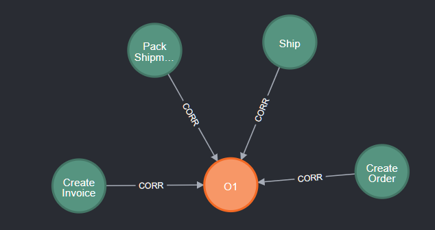
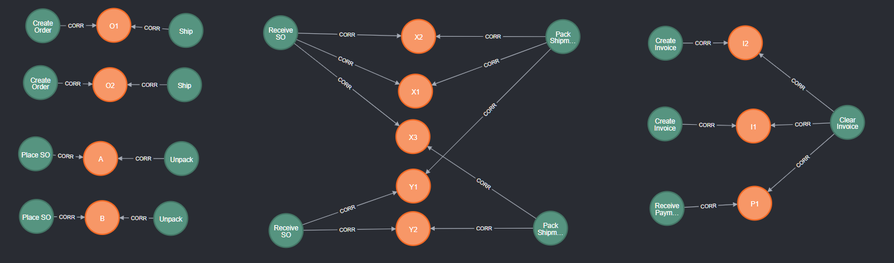
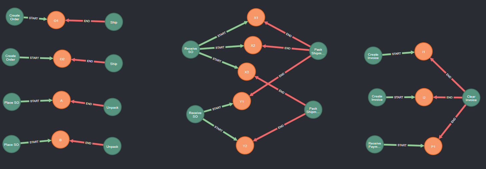
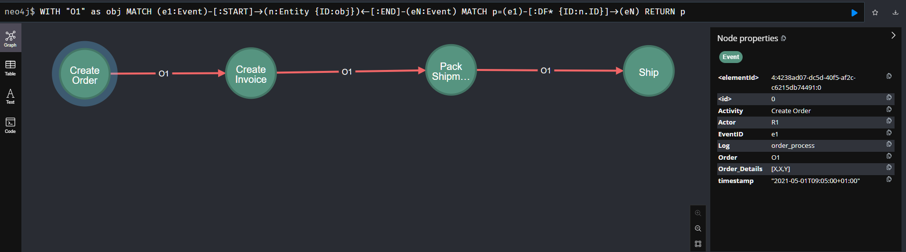
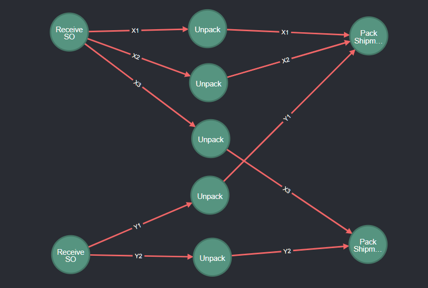

# Tutorial OCPM 2: Analyzing Object Traces

This tutorial is part of a series of tutorials for realizing Object-Centric Process Mining (OCPM) with Event Knowledge Graphs (EKGs).

This tutorial explains basic queries for analyzing the behavior of individual objects in an EKG. We cover
  * Querying start and end points of objects
  * Querying object traces
  * Summarizing all object traces into an **object trace variant summary**

These queries form the basis for many more advanced analyses.

## 0. Prerequisites

  * You complete the [the tutorial on building event knowledge graphs](./tutorial-your-first-event-knowledge-graph.md)
     * You have a running instance of Neo4j
     * You have imported events and constructed an EKG

## 1. Current EKG

Through the [tutorial](./tutorial-your-first-event-knowledge-graph.md) you should have constructed the following EKG 


It contains following types of nodes
  * **:Event** nodes, shown in green, describing occurrences of an activity at a particular point in time, furter described by various properties
  * **:Entity** nodes, shown in orange, describing the process objects and other entities in the process
  * **:CORR** (correlation) relationships, shown in grey, where  `(e:Event) -[:CORR]-> (n:Entity)` states that event *e* refers to entity *n*
  * **:DF** (directly-follows) relationships, shown in red, where `(e1:Event) -[:DF { ID:"o1" }]-> (e2:Event)` states that event *e1* is directly followed by event *e2* from the perspective of an entity *n* with `n.ID=o1`

### 1.1 Event Layer of the EKG

Querying only for events and df-relations with `match (e1:Event)-[df:DF]->(e2:Event) return e1,df,e2` shows us this **behavioral part** of the EKG


It describes the process execution in an object-centric way, ordering events not wrt. to a global case identifier but wrt. the individual objects the events are correlated to. See also the Open Access Book Chapter [Process Mining over Multiple Behavioral Dimensions with Event Knowledge Graphs](https://link.springer.com/chapter/10.1007/978-3-031-08848-3_9).

### 1.2 Object Layer of the EKG

We can query the object part of the EKG using
```
MATCH (n:Entity)
OPTIONAL MATCH (n:Entity)-[r]-(n2:Entity)
RETURN n,r,n2
```
which returns all :Entity nodes and (optionally) all relations between :Entity nodes. Doing so on this EKG returns the **object part** of the EKG.


Note that the relations between objects are only returned if you also followed the [OCPM tutorial on inferring relations between objects](./tutorial-ocpm-relations.md). However, the relations are not relevant for this tutorial.


## 2. Traces of Objects

We can easily query all events of a specific object with `MATCH (n:Entity {ID:"O1"}) -[c:CORR]-> (e:Event) RETURN n,c,e` resulting in:



We are interested in querying the actual *trace* of an object or a group of objects. A *trace* in an EKG is a *path* of **:Event** nodes connected by **:DF** relationships. More precisely, a trace is a *maximal path* of **:Event** nodes connected by **:DF**. To find this maximal path, we 

* First have to query where **:DF** paths start and end, i.e., we query for **start events** and **end events** of objects, which in itself gives useful insights into the process in an object-centric setting.
* And then we can query for the **maximal path** from start to end.

### 2.1 Start and End Events of an Object

A **start event** of an object *n* is an **:Event** node *e1* without any *incoming* **:DF** relationship that refers to *n*. Likewise, an **end event** of an object *n* is an **:Event** node *eN* without any *outgoing* **:DF** relationship that refers to *n*. We can express this in the following query:

```
// Query start event e1 and end event eN of entity n
MATCH (n:Entity)
  // find e1 with no incoming DF edge that refers to n (i.e., there is no edge df with df.ID = n.iD)
MATCH (n)<-[c1:CORR]-(e1:Event) WHERE NOT ()-[:DF {ID:n.ID}]->(e1)
  // find eN with no incoming DF edge that refers to n (i.e., there is no edge df with df.ID = n.iD)
MATCH (eN:Event)-[cN:CORR]->(n) WHERE NOT (eN)-[:DF {ID:n.ID}]->()
RETURN e1,c1,n,cN,eN
```

Running this query on the EKG of the order process returns each entity node and its associated start and end event (but does not show any ordering between these events).



We can see
* **Orders** O1, O2, and **Supplier Orders** A,B showing a simple structure 
  * Orders O1, O2 have the same activities for start and end events
  * Supplier Orders A, B have the same activities for start and end events
* The **Items** show a more interesting structure
  * Items X1,X2,X3 not only share the same start activity *Receive SO*, but also **share the exact same start event**; likewise for Items Y1,Y2
  * The Items also share two end events (of the same activity)
  * But the Items **synchronize in different end events** (X1,X2,Y1 synchronize and X3, Y2 synchronize)
* Also **objects of different types** (Invoices, Payment) can share start or end events
  * Both Invoices I1 and I2 have the distinct start events with the same start activity *Create Invoice*
  * I1,I2,P1 synchronize in the same end event (with activity *Clear Invoice*)

While we can recognize these start and end events also in the *Event Layer* of the EKG (shown at the start of the tutorial), this more query and visualization  gives a more distinct understanding of 
* the indiviual objects' start and end events as well as
* in what sense objects are
  * created or started separately (e.g., O1, O2, A, B, I1, I2, P1)
  * created or started jointly (e.g., X1,X2,X3 and Y1,Y2)
  * concluded or ended separately  (e.g., O1, O2, A, B)
  * concluded or ended jointly (e.g., X1,X2,Y1 and X3,Y2 and I1,I2,P1)

The latter gives us a sense that **we have to understand object-centric processes as a network** rather than just a set of objects.

### 2.2 Materializing Knowledge about Start and End Events

We will subsequently often have to query for start and end events of an object. While we can reuse the above query, it is not the most readable or intuitive query and it requires a sub-query to check for absence of incoming and outgoing **:DF** relationships.

We can improve readability and improve query performance by **materializing the knowledge about start and end events** with the following two queries:

```
// Infer start event of an object
MATCH (n:Entity)
// find e with no incoming DF edge that refers to n (i.e., there is no edge df with df.ID = n.iD)
MATCH (n)<-[c:CORR]-(e:Event) WHERE NOT ()-[:DF {ID:n.ID}]->(e)
// materialize as :START relation 
MERGE (n)<-[:START]-(e)
```

```
// Infer end event of an object
MATCH (n:Entity)
// find e with no outgoing DF edge that refers to n (i.e., there is no edge df with df.ID = n.iD)
MATCH (n)<-[c:CORR]-(e:Event) WHERE NOT (e)-[:DF {ID:n.ID}]->()
// materialize as :END relation 
MERGE (n)<-[:END]-(e)
```

With start and end events inferred, we can directly query start and end events of objects with 
```
MATCH (start:Event)-[st:START]->(n:Entity)<-[en:END]-(end:Event) 
RETURN start,st,n,en,end`
```

and the resulting graph now also explicitly visualizes which events are start or end events.



### 2.3 Trace of a specific Object

We can now easily query the trace of a specific object as a **path of events along *:DF* relationships** as follows:

```
// Query trace (directly-follows path) of a specific object (or entity) identified by 'objId'
WITH "O1" as objId
// retrieve start and end events
MATCH (e1:Event)-[:START]->(n:Entity {ID:objId})<-[:END]-(eN:Event)
// retrieve path from start to end event, along all DF relationships referring to objects identifier
MATCH p=(e1)-[:DF* {ID:n.ID}]->(eN)
// return the entire path
RETURN p
```

This query
* first retrieves the *:Entity* node *(n)* identified by `n.ID=objId` and its start and end events *(e1)* and *(eN)*
* and uses `MATCH p=(e1)-[:DF* {ID:n.ID}]->(eN)` to query  
  * a path from node *(e1)* - the start event of the object node *n* - to node *(eN)*  - the end event of the object node *n* 
  * that only consists of an arbitraty number of *:DF* relationships (indicated by the `*` after `:DF`)
  * and each of these *:DF* relationships must have property `ID = n.ID` which is the identifier of the object for which we want to retrieve the path;
* and the entire resulting path of nodes and relatonships is bound to the *path variable* p which is then returned.

Visualizing this path yields.



There is a corner case which is not covered by the above query: a trace consisting of only a single event: when start and end events are identical, i.e., *e1 = eN*, then query ``MATCH p=(e1)-[:DF* {ID:n.ID}]->(eN)` does not return a path. The following query handles this using Cypher's `UNION` operator: 

```
// general query for all traces of all lengths
MATCH (n:Entity) WITH n // for each entity node n

  // query paths of length > 1
  MATCH (e1:Event)-[:START]->(n)<-[:END]-(eN:Event)
  MATCH p=(e1)-[:DF* {ID:n.ID}]->(eN)
  RETURN p

UNION

  // query paths of length = 1 where start and end are identical
  MATCH (e:Event)-[:START]->(n)<-[:END]-(e:Event)
  MATCH p=(e)
  RETURN p
```

This query returns all object traces in the data. For simplictiy and readailbity, we will leave out the second case and the `UNION` operator in all following queries as our example data has no traces of length 1. However, your trace queries should include the case distinction to reliably return all traces.

### 2.4 Events of a specific Object

If we are not interested in the entire trace as path of nodes and relations, but just the events, have two options.

Option 1: retrieve the nodes of the path *p* in the previous query

```
// Query trace (directly-follows path) of a specific object (or entity) identified by 'objId'
WITH "O1" as objId
// retrieve start and end events
MATCH (e1:Event)-[:START]->(n:Entity {ID:objId})<-[:END]-(eN:Event)
// retrieve path from start to end event, along all DF relationships referring to objects identifier
MATCH p=(e1)-[:DF* {ID:n.ID}]->(eN)
// return the event nodes of path
RETURN nodes(p) AS events
```

Options 2: directly retrieve the event nodes of the object (and order them by time)

```
// Query trace (directly-follows path) of a specific object (or entity) identified by 'objId'
WITH "O1" as objId
// retrieve events
MATCH (e:Event)-[:CORR]->(n:Entity {ID:objId})
// and collect events in a list ordered by timestamp
WITH n, e ORDER BY e.timestamp
WITH n, collect(e) AS events
RETURN events
```

Option 2 avoids a path-search query `MATCH p=(e1)-[:DF* {ID:n.ID}]->(eN)` which - depending on the structure of the graph and the specific query engine/graph DB used- may take more time than Option 1.

For simplicity, we will keep using queries based on option 1 in the following. But whenever we are actually only interested in the events, then you may replace it with option 2.

### 2.5 Traces of all objects of a specific type

We are usually interested in analyzing entire event logs which are sets of traces. In classical process mining, all traces in a log originate from the same process. In an object-centric setting, where we have various interacting objects, we could build a simple log from the traces of all *objects of the same type*. Here is the query:

```
WITH "Item" as objType
// for each object n of type objType
MATCH (n:Entity {EntityType:objType})
// retrieve start and end events
MATCH (e1:Event)-[:START]->(n:Entity {ID:objId})<-[:END]-(eN:Event)
// retrieve trace of object n
MATCH p=(e1)-[:DF* {ID:n.ID}]->(eN)
RETURN p
```

Running this, we obtain the following 'event log' for  the objects of type *Item*.



* 5 traces for 5 *Items*
* Same events are part of multiple traces, i.e., the start and end events, respectively.

While we can study the traces individually (and we will do so in a moment), the fact that we represent each event as its own unique node allows us to also directly observe where traces of different objects in the same 'log' synchronize.

## 3. Object variants, or, Trace variants of objects

### 3.1 Querying object variants
In process mining, traces are the starting point for the actual analysis, which consists of computations over traces and extracting features from traces. A basic, but very relevant step is to summarize the traces in a log regarding its trace variants, i.e., the activity sequences. We can do the same for object traces with a simple extension of the path queries.

The following query maps each retrieved trace into the sequence of activities occurring along the trace.

```
// Query trace variants of all objects
MATCH (n:Entity) WITH n // for each object
// Query trace of n
MATCH (e1:Event)-[:START]->(n)<-[:END]-(eN:Event)
MATCH p=(e1)-[:DF* {ID:n.ID}]->(eN)
// Map trace p to activity sequence
RETURN n.ID, [event IN nodes(p) | event.Activity] AS traceVariant
```

Running this query yields the following table

| n.ID |	traceVariant |
|-------|------|
| "O1" | ["Create Order", "Create Invoice", "Pack Shipment", "Ship"] |
| "O2" | ["Create Order", "Create Invoice", "Update SO", "Pack Shipment", "Ship"]  |
| "A" | ["Place SO", "Receive SO", "Unpack", "Unpack", "Unpack"] |
| "B" | ["Place SO", "Update SO", "Receive SO", "Unpack", "Unpack"] |
| "X1" | ["Receive SO", "Unpack", "Pack Shipment"] |
| "X2" | ["Receive SO", "Unpack", "Pack Shipment"] |
| "X3" | ["Receive SO", "Unpack", "Pack Shipment"] |
| "Y1" | ["Receive SO", "Unpack", "Pack Shipment"] |
| "Y2" | ["Receive SO", "Unpack", "Pack Shipment"] |
| "I2" | ["Create Invoice", "Update Invoice", "Clear Invoice"] |
| "I1" | ["Create Invoice", "Clear Invoice"] |
| "P1" | ["Receive Payment", "Clear Invoice"] |

We can generate a summary of the trace variants by aggregating by the traceVariant with the following query:

```
// Query trace variants of all objects
MATCH (n:Entity) WITH n // for each object
// Query trace variant of n
MATCH (e1:Event)-[:START]->(n)<-[:END]-(eN:Event)
MATCH p=(e1)-[:DF* {ID:n.ID}]->(eN)
WITH n, [event IN nodes(p) | event.Activity] AS traceVariant
// aggregate by traceVariant, count frequency, types, and object ids
RETURN traceVariant, count(n) AS frequency, collect(n.EntityType) AS types, collect(n.ID) AS objects
```

Running this query generates the following object summary for our example data.

| traceVariant | frequency | types | objects |
|-------|-------|-------|-------|
| [Create Order, Create Invoice, Pack Shipment, Ship] | 1 | [Order] | [O1] |
| [Create Order, Create Invoice, Update SO, Pack Shipment, Ship] | 1 | [Order] | [O2] |
| [Place SO, Receive SO, Unpack, Unpack, Unpack] | 1 | [Supplier Order] | [A] |
| [Place SO, Update SO, Receive SO, Unpack, Unpack] | 1 | [Supplier Order] | [B] |
| [Receive SO, Unpack, Pack Shipment] | 5 | [Item, Item, Item, Item, Item] | [X1, X2, X3, Y1, Y2] |
| [Create Invoice, Update Invoice, Clear Invoice] | 1 | [Invoice] | [I2] |
| [Create Invoice, Clear Invoice] | 1 | [Invoice] | [I1] |
| [Receive Payment, Clear Invoice] | 1 | [Payment] | [P1] |

The trace variant overview shows us that only object of type *Item* are consistently handled in the same way. Each other object type exhibits (unique) variations. 

### 3.2 Relevance of object variants

While uniqueness on this small example dataset bears no significance, uniqueness in a real-life dataset would be a relevant indicator of problems in the process that are worth investigating.

By being able to summarize the object-centric data per object, we obtain a first angle from which to further investigate the data.

## 4 Wrap-Up

This tutorial covered how to 
  * retrieve start and end events of an object,
  * materialize knowledge about start and end events to reuse in subsequent queries,
  * retrieve traces of an object, all objects of a type, and of all objects,
  * summarize object traces by computing an **object trace variant summary**.

By doing this, we also established further tools fo runderstand object-centric event data:
  * We can understand how the start and end of object life-cycles of different objects are synchronized.
  * We can retrieve and understand how traces of objects (of the same or different types) relate to each other.
  * We can identify through the **object trace variant summary** how uniform or unique all objects are handled, allowing to identify objects of interest for further analysis.

Note that - depending on the analysis aims - you can extract further features from the traces by mapping event nodes in a trace to other features of interest.