# Tutorial 1: Building Your First Event Knowledge Graph with Neo4j and Cypher

This first tutorial introduces you to the basics of building event knowledge graphs from event tables, using the database system Neo4j and the Cypher query language. 

Below you find instructions for downloading and setting up the necessary software. The tutorial then covers step by step the Cypher queries needed to build event knowledge graphs.

If you are familiar with Neo4j and Cypher or just want the essence, then follow the [quick version of the tutorial](./tutorial-your-first-event-knowledge-graph-quick.md).

## 1 Download and Install

To follow this tutorial you need
* an instance of the Neo4j database
* the tutorial files
* Python3 (tested on Python 3.7.9) with the following packages
   * `neo4j`
   * `graphviz`


### 1.1 Neo4j

You need a clean instance of Neo4j running for this tutorial.
1. Download and install Neo4j, e.g., Neo4j Desktop from [https://neo4j.com/download/]
2. Create a new Neo4j instance, see [https://neo4j.com/docs/desktop-manual/current/operations/create-dbms/]  
   This example assumes the default user '**neo4j**' with password '**1234**', which you can set when creating a new neo4j instance.

#### How to configure Neo4j for local file import

This example imports the event data from a local file. By default Neo4j does not allow importing data from arbitrary local URLs. To allow Neo4j importing a file from a local directoy, take the following steps:

1. Find the `neo4j.conf` file for your Neo4j installation, see [https://neo4j.com/docs/operations-manual/current/configuration/file-locations/].  
   If you are using Neo4j Desktop, the neo4j.conf file is located under _&lt;yourGraph&gt; > Manage > Settings_ (you have to stop the DB instance first)
2. Comment out this line (by adding `#` at the start of the line):  
   `dbms.directories.import=import`
3. Uncomment this line to allow CSV import from file URL:  
   `#dbms.security.allow_csv_import_from_file_urls=true`

#### How to start and connect to Neo4j

Start the configured Neo4j instance. You can connect to the Neo4j instance via
* the [Neo4j browser](https://neo4j.com/docs/browser-manual/current/) to enter [Cypher queries](https://neo4j.com/docs/cypher-manual/current/introduction/) directly
* via Python with package `neo4j` and the following code
```
from neo4j import GraphDatabase
driver = GraphDatabase.driver("bolt://localhost:7687", auth=("neo4j", "1234")) 
```

### 1.2 Tutorial files

Download all files of this repository/unzip the file into a directory _&lt;tutorial&gt;_ with no dash character '-' in the entire directory path. Otherwise data import into Neo4j will not succeed.


## 2 Preparing Event Data for Import

The input data for this tutorial is a single event table in `.csv` format: [./input_logs/order_process_event_table_orderhandling.csv](./input_logs/order_process_event_table_orderhandling.csv) which contains multiple records, each describing one event that has been executed with the following attributes:
* a timestamp attribute `time`
* an attribute `event` describing the activity that has been executed
* several other attributes describing entity identifiers, e.g., `Order` and `Supplier Order`, or properties of these entities, e.g., `Order Details`

The input data is not yet in shape to be imported into Neo4j and we need to pre-process it
* the `time` attribute format has to be converted to a full UTC timestamp `YYYY-MM-DD hh:mm:ss.fff+timezone` and renamed to a standard attribute name `timestamp`
* the attribute name `event` is ambiguous, our subsequent queries assume a standard attribute name `Activity`
* column names cannot contain spaces, e.g., we have to rename `Supplier Order` to `SupplierOrder`

The python script [./0_prepare_log_for_import.py](./0_prepare_log_for_import.py) does that for us. The script itself has provisions for more preprocessing options, e.g., preprocessing specific to individual records, deriving unique event identifiers from other attributes, etc.

Running the script will read the file [./input_logs/order_process_event_table_orderhandling.csv](./input_logs/order_process_event_table_orderhandling.csv), preprocess it, and output [./prepared_logs/order_process_event_table_orderhandling_prepared.csv](./prepared_logs/order_process_event_table_orderhandling_prepared.csv) which is ready for Neo4j import.

## 3 Building Event Knowledge Graphs

We now start from the prepared event table [./prepared_logs/order_process_event_table_orderhandling_prepared.csv](./prepared_logs/order_process_event_table_orderhandling_prepared.csv). Building an event knowledge graph takes the following steps.

* **4. Importing events** - Importing all event records from [./prepared_logs/order_process_event_table_orderhandling_prepared.csv](./prepared_logs/order_process_event_table_orderhandling_prepared.csv) into Neo4j as `:Event` nodes
* **5. Inferring entities**  - Identify entity types in the event attributes and derive `:Entity` nodes for each entity type and create `:CORR` (correlation) relationships between `:Event` and `:Entity` nodes to model which events have been observed for which entity
* **6. Inferring temporal relations** - Infer `:DF` (directly-follows) relationships from between `:Event` nodes correlated to the same `:Entity` node

For each step, we first show and explain the `Cypher` query that can be executed directly in the Neo4j browswer and then point to the Python scripts that automate the steps, and finally the entire procedure.

## 4 Importing events

### 4.1 Import event records as event nodes

Open Neo4j browser (or any other Neo4j console) and enter the following Cypher query to import events from  [./prepared_logs/order_process_event_table_orderhandling_prepared.csv](./prepared_logs/order_process_event_table_orderhandling_prepared.csv) into Neo4j. Make sure to replace the placeholder _&lt;eventgraph_tutorial&gt;_ with the full OS directory path to where you unzipped the tutorial files, e.g., `D:/data/eventgraph_tutorial/` or `/home/myUsername/eventgraph_tutorial/`.

```
LOAD CSV WITH HEADERS FROM "file:///<eventgraph_tutorial>/order_process/prepared_logs/order_process_event_table_orderhandling_prepared.csv" as line CREATE (e:Event {Log: "order_process",EventID: line.EventID, Activity: line.Activity, timestamp: datetime(line.timestamp), Actor: line.Actor, Order: line.Order, SupplierOrder: line.SupplierOrder, Order_Details: line.Order_Details, Item: line.Item, Invoice: line.Invoice, Payment: line.Payment, Tray: line.Tray })
```

The `LOAD CSV ..  as line` command loads each row of the input `.csv` file separately into the variable `line` and then executes the `CREATE (...)` query for each `line`. The `CREATE` query creates per `line` one `(:Event {...})` node with several properties specified between `{ ... }`. The property values are set according to the values in variable `line`, for example property `Activity` is set from the value `line.Activity`.

Executing the query should yield the following response
```
Added 21 labels, created 21 nodes, set 151 properties, completed after 10 ms.
```

Note: the above query is not scalable to large input files of 1000s of event records. It also requires you to manually type out all columsn in the CSV data. In another tutorial we show to automate the construction of the query and embed the query into a transaction that will improve performance, but for now we focus on the essence.

### 4.2 Query the event nodes imported

In the Neo4j browser, we can query for the event nodes we just imported and inspect them. Enter
```
MATCH (e:Event) RETURN e
```
to retrieve all `:Event` nodes that were created. Neo4j will visualize the nodes. You can inspect the details of a node by hovering over it.

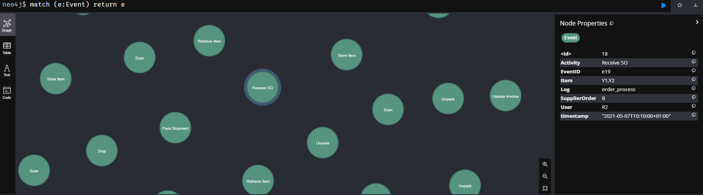

We can query for a specific subset of events by their properties
```
MATCH (e:Event {Order:"O1"}) RETURN e
```
which returns only the subset of nodes that have the specified property
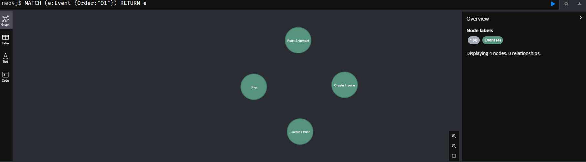

We can also query for just properties instead of entire nodes
```
MATCH (e:Event) RETURN e.Order,e.Order_Details,e.SupplierOrder,e.Item,e.Invoice,e.Payment,e.Actor
```
which returns a table with the queried properties
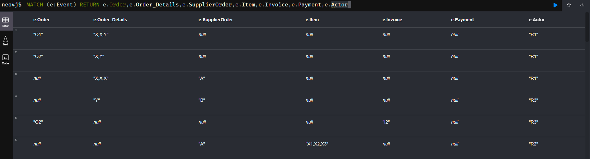

If we are interested in the dinstinct values of a specific property over all event nodes, we can use the following query.
```
MATCH (e:Event) WHERE e.Item <> "null" RETURN distinct e.Item
```
which returns all distinct values of property **Item**
| e.Item  |
|---------|
| "X1,X2,X3" |
| "X3"       |
| "X1"       |
| "X2"       |
| "Y1,Y2"    |
| "Y1"       |
| "Y2"       |
| "X1,X2,Y1" |
| "X3,Y2"    |

See the [Cypher documentation on MATCH](https://neo4j.com/docs/cypher-manual/current/clauses/match/) for further details on querying nodes.

### 4.3 Working with lists of values (and necessary pre-processing)

If we inspect the output of the previous query `MATCH (e:Event) WHERE e.Item <> "null" RETURN distinct e.Item` in detail then we see that some events have string properties that actually describes a **list** of values. For instance `"X1,X2,X3"`. To be able to query for individual values, we have to split the string stored in ``Item`` on the delimiter `','` into a list of strings, and then store this list as the new value of ``e.Item``. The following query achieves this.
```
MATCH (e:Event) WHERE e.Item <> "null"
WITH e,split(e.Item, ',') AS items
SET e.Item=items
```
Running again the query `MATCH (e:Event) WHERE e.Item <> "null" RETURN distinct e.Item` now gives us.
| e.Item  |
|---------|
| ["X1","X2","X3"] |
| ["X3"] |
| ["X1"] |
| ["X2"] |
| ["Y1","Y2"] |
| ["Y1"] |
| ["Y2"] |
| ["X1","X2","Y1"] |
| ["X3","Y2"] |

Each value for _Item_ now is a list of identifiers. We can use `UNWIND` on `e.Item` to iterate over the list and retrieve the individual values. The following query does this and returns all distinct __Item__ values in the data.
```
MATCH (e:Event) UNWIND e.Item AS item_val
RETURN DISTINCT item_val
```
As we use `UNWIND`, we can omit the check `WHERE e.Item <> "null"`. We obtain the following result:
| item_val  |
|---------|
| "X1" |
| "X2" |
| "X3" |
| "Y1" |
| "Y2" |

`UNWIND` can also be applied on properties that are not a list of values - it will then simply give back the single value stored in that property.

To complete preparing our input data, we have to apply the 'split' query on all proeprties with list values, which are
* __Item__ (already done)
* __Invoice__ with  `MATCH (e:Event) WHERE e.Invoice <> "null" WITH e,split(e.Invoice, ',') AS vals SET e.Invoice=vals`
* __Order_Details__  with `MATCH (e:Event) WHERE e.Order_Details <> "null" WITH e,split(e.Order_Details, ',') AS vals SET e.Order_Details=vals`
* __Tray__ with `MATCH (e:Event) WHERE e.Tray <> "null" WITH e,split(e.Tray, ',') AS vals SET e.Tray=vals`

In a later tutorial we discuss how to replace multiple almost idential queries by a parameterized query. For this tutorial, we stick to verbatim repetitions.


## 5 Inferring entities

If you followed the previous steps, you now have a graph which consists only of disconnected `:Event` nodes. Each event node has various properties. 

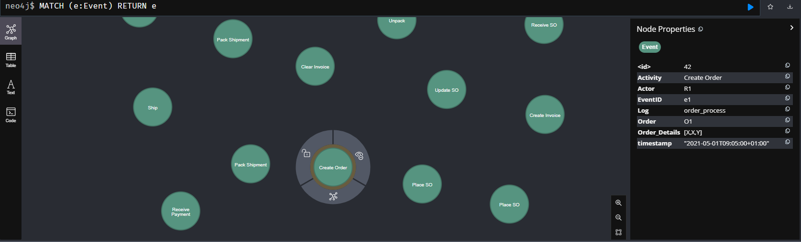

Our next step is to connect the events. We first identify _structural_ information: to which _objects_ or _entities_ is an event related. We will introduce new nodes and relationships to model how events relate to objects.

### 5.1 Identify entity types

If we inspect the event node properties, for example with the previous query `MATCH (e:Event) RETURN e.Order,e.Order_Details,e.SupplierOrder,e.Item,e.Invoice,e.Payment,e.Actor`, we can see that some properties hold identifiers for entities of a specific type. 

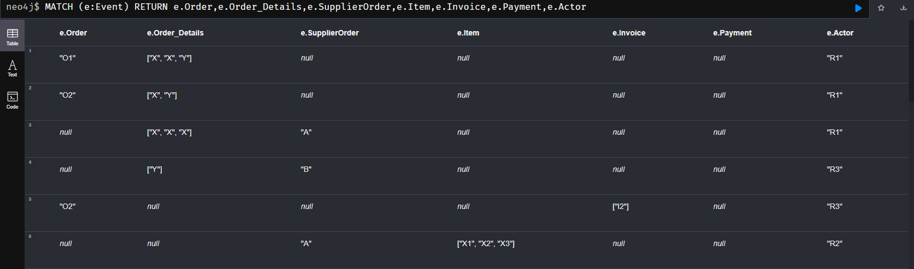

For example, property _Order_ holds identifiers _O1_ and _O2_ referring to two different orders. By exploring and querying the data - combined with some domain knowledge or common sense - we can pick out which properties describe entity types. In the tutorial data, these are
* data objects
   * _Order_
   * _SupplierOrder_
   * _Item_
   * _Invoice_
   * _Payment_
* humans/users
   * _Actor_

While property *Item* refers to individual entities _X1,X2,X3_, property *Order_Details* does not identify individual entities with values such as _X,X,Y_ but just types of entities themselves, i.e., two _X_ which are not further distinguished. It generally requires domain knowledge to safely understand whether a property refers to individual entities or is itself just a generic value.

To confirm and understand which concrete entities identifers are in the data, we can query all unique values per entity property. Remeber to use `UNWIND` on the event property to handle list values as well as singleton values. For example, `MATCH (e:Event) UNWIND e.Item AS itemId RETURN DISTINCT itemId` returns
| itemId |
|---------|
| "X1"  |
| "X2"  |
| "X3"  |
| "Y1"  |
| "Y2"  |

This means, property _Item_ directly holds five distinct entity identifiers. Doing the same for the other entity types shows us

| property | distinct values |
|----------|-----------------|
| _Order_ | _O1, O2_ |
| _SupplierOrder_ | _A, B_ |
| _Item_ | _X1, X2, X3, Y1, Y2_ |
| _Invoice_ | _I1, I2_ |
| _Payment_ | _P1_ |
| _Actor_ | _R1, R2, R3, R4, R5_ |

### 5.2 Create entity nodes

We now want to explicitly model which events refer to the same entity. We therefore materialize each distinct entity identifier value as a new unique `:Entity` node.

With the following query, we create for each identifier value of _Order_ a new unique `:Entity` node of type _Order_ with a specific `ID`. In other words, we materialize the entity we saw as attribute as a new node (that we later can refer to).

```
MATCH (e:Event) UNWIND e.Order AS id_val
WITH DISTINCT id_val
CREATE (:Entity {ID:id_val, EntityType:"Order"})
```

This creates two new `:Entity` nodes, one for *id_val=O1* and one for *id_val=O2*. We can query for the two new `:Entity` nodes with `MATCH (n:Entity {EntityType:"Order"}) RETURN n`. 


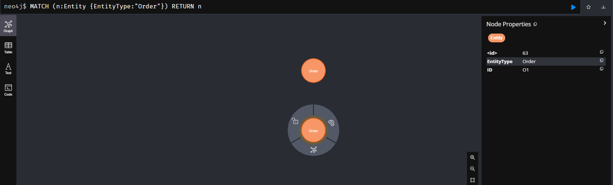

Note that executing the above query a second time will again create two `:Entity` nodes, resulting in two `:Entity` nodes with _ID="O1"_ and two `:Entity` nodes with _ID="O2"_. First, you can clean up such mistakes with the query `MATCH (n:Entity {EntityType:"Order"}) DELETE n` which will delete all `:Entity` nodes where `EntityType="Order"`. Second, by using `MERGE` instead of `CREATE` the will not create a new node if there already exists a node with the same label and properties:

```
MATCH (e:Event) UNWIND e.Order AS id_val
WITH DISTINCT id_val
MERGE (:Entity {ID:id_val, EntityType:"Order"})
```

We can easily adopt the above query to infer entity nodes for all the other entity types as well.
* __Order__ (already done)
* __SupplierOrder__ with `MATCH (e:Event) UNWIND e.SupplierOrder AS id_val WITH DISTINCT id_val MERGE (:Entity {ID:id_val, EntityType:"SupplierOrder"})`
* __Item__ with `MATCH (e:Event) UNWIND e.Item AS id_val WITH DISTINCT id_val MERGE (:Entity {ID:id_val, EntityType:"Item"})`
* __Invoice__ with  `MATCH (e:Event) UNWIND e.Invoice AS id_val WITH DISTINCT id_val MERGE (:Entity {ID:id_val, EntityType:"Invoice"})`
* __Payment__ with  `MATCH (e:Event) UNWIND e.Payment AS id_val WITH DISTINCT id_val MERGE (:Entity {ID:id_val, EntityType:"Payment"})`

For now, we do not add `:Entity` dnoes for __Actor__ entities for now to keep the graph structure simpler. We will add them in a different tutorial when we specifically focus on analyzing actor behavior in a process.

In a later tutorial we discuss how to replace multiple almost idential queries by a parameterized query. For this tutorial, we stick to verbatim repetitions.

Querying for all nodes in the graph with `MATCH (n) return n` shows us a graph of 21 `:Event` nodes and 12 `:Entity` nodes that are all disconnected.

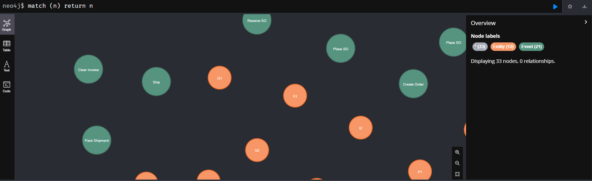

### 5.3 Correlate events to entity nodes

To explicitly model which events refer to which entities, we add _correlation_ relationships (label `:CORR`). The following query creates a `:CORR` relationship from any _:Event_ that refers to an _Item_ value _id_ to the _:Entity_ with _EntityType=Item_ and the same _id_.

```
MATCH (e:Event) UNWIND e.Item AS id_val WITH e,id_val
MATCH (n:Entity {EntityType: "Item"}) WHERE id_val = n.ID
MERGE (e)-[:CORR]->(n)
```
This query should create 15 `:CORR` relationships. We now have created the first interesting graph structure that we can query with
```
MATCH (n:Entity {EntityType:"Item"})<-[c:CORR]-(e:Event) RETURN e,c,n
```
which returns the following graph

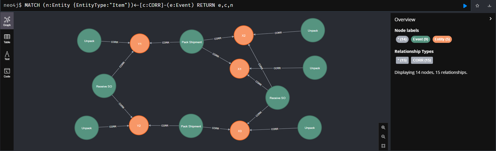

From the graph, we can see the following:
* _X1_, _X2_, and _X3_ are correlated to the same _Receive SO_ event, while _Y1_ and _Y2_ are correlated to another _Receive SO_ event. 
* The items are grouped differently at _Pack Shipment_, one _Pack Shipment_ event is correlated to _X1_, _X2_, and _Y1_, while the other _Pack Shipment_ event is correlated to _X3_ and _Y2_. 
* In contrast, each _Unpack_ event is correlated to just one item.

Just as before, here are the verbatim queries to add `:CORR` relationships for the other entity types, leaving the parameterized query to another tutorial.

We can easily adopt the above query to infer entity nodes for all the other entity types (excep Actors) as well.
* __Order__ with `MATCH (e:Event) UNWIND e.Order AS id_val WITH e,id_val MATCH (n:Entity {EntityType: "Order"}) WHERE id_val = n.ID MERGE (e)-[:CORR]->(n)` creates 9 relationships
* __SupplierOrder__ with `MATCH (e:Event) UNWIND e.SupplierOrder AS id_val WITH e,id_val MATCH (n:Entity {EntityType: "SupplierOrder"}) WHERE id_val = n.ID MERGE (e)-[:CORR]->(n)` creates 10 relationships
* __Item__ (already done)
* __Invoice__ with  `MATCH (e:Event) UNWIND e.Invoice AS id_val WITH e,id_val MATCH (n:Entity {EntityType: "Invoice"}) WHERE id_val = n.ID MERGE (e)-[:CORR]->(n)` creates 5 relationships
* __Payment__ with  `MATCH (e:Event) UNWIND e.Payment AS id_val WITH e,id_val MATCH (n:Entity {EntityType: "Payment"}) WHERE id_val = n.ID MERGE (e)-[:CORR]->(n)` creates 2 relationships

### 5.4 Querying for correlation information

Querying for the resulting graph with the query `MATCH (n:Entity)<-[c:CORR]-(e:Event) RETURN e,c,n` gives us the following network of events and entities.

")

## 6. Inferring temporal relations

The graph until now only describes a very basic structure: which events are correlated to which entities. But events are ordered in time by their _timestamp_ attribute. We now explicitly model this temporal information in our graph. Our goal is to model how each entity "evolved" over time. Thus, we only order the events that are correlated to the same entity.

We first explain this just for the _Item_ entity in detail and then generalize it to all entities.

### 6.1 Infer directly-follows relationships per entity

The _:Event_ nodes correlated to the same _:Entity_ node describe the changes observed for that entity. To describe the order in which these events occurrred for this entity, we do the following:
* Sort all events correlated to the same entity by _timestamp_, and
* add a _directly-follows_ relationship (label `:DF`) between any two subsequent events.
The following query will do this for all entity nodes of type _Item_.
```
MATCH (n:Entity {EntityType:"Item"})
MATCH (n)<-[:CORR]-(e)
WITH n, e AS nodes ORDER BY e.timestamp, ID(e)
WITH n, collect(nodes) AS event_node_list
UNWIND range(0, size(event_node_list)-2) AS i
WITH n, event_node_list[i] AS e1, event_node_list[i+1] AS e2
MERGE (e1)-[df:DF {EntityType:n.EntityType, ID:n.ID}]->(e2)
```
The query does the following
* We match all events of the entity
* sort the events by their timestamp (using `ORDER BY`)
* collect the sorted events in a list (using `collect(...)`), 
* then iterate over the list (using `UNDWIND`), and 
* add a new `:DF` relationship between any two subsequent events, where the relationship also holds the type and identifier of the entity `n` for which this relationship holds.

The `ORDER BY` clause considers _e.timestamp_ and neo4j's internal node id _ID(e)_. We do this to ensure that in case two events have the exact same timestamp, they are always ordered in the same way.

Running the above query creates 10 `:DF` relationships.

### 6.2 Querying the graph of Events and directly-follows relationships

The following query retrieves all `:DF` relationships (created so far) in the data. 
```
MATCH (e1:Event)-[df:DF]->(e2:Event) RETURN e1,df,e2
```
Having only created `:DF` relationships for _Item_ entities thus gives us the following graph.

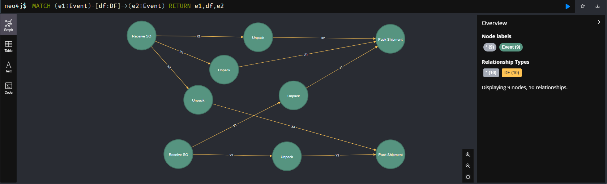

We can see that 
* both  _Receive SO_ events precede the _Unpack_ events which are followed by _Pack Shipment_ events; 
* the `:DF` relationships are forming 5 DF-paths, one **DF-path for each _Item_ entity _X1_, _X2_, _X3_, _Y1_, _Y2_**.

To not just retrieve the existing DF-relationships but also all other events that may not have a DF-relationship (yet), we can use the following query.
```
MATCH (e1:Event)
OPTIONAL MATCH (e1:Event)-[df:DF]->(e2:Event)
RETURN e1,df,e2
```
It retrieves all events `e1` and then, by using `OPTIONAL`, also the `:DF` relationships for these events `e1` that _do have_ an outgoing `:DF` relationship. Without `OPTIONAL`, we would only match the events `e1` that also have an outgoing `DF` relationship.

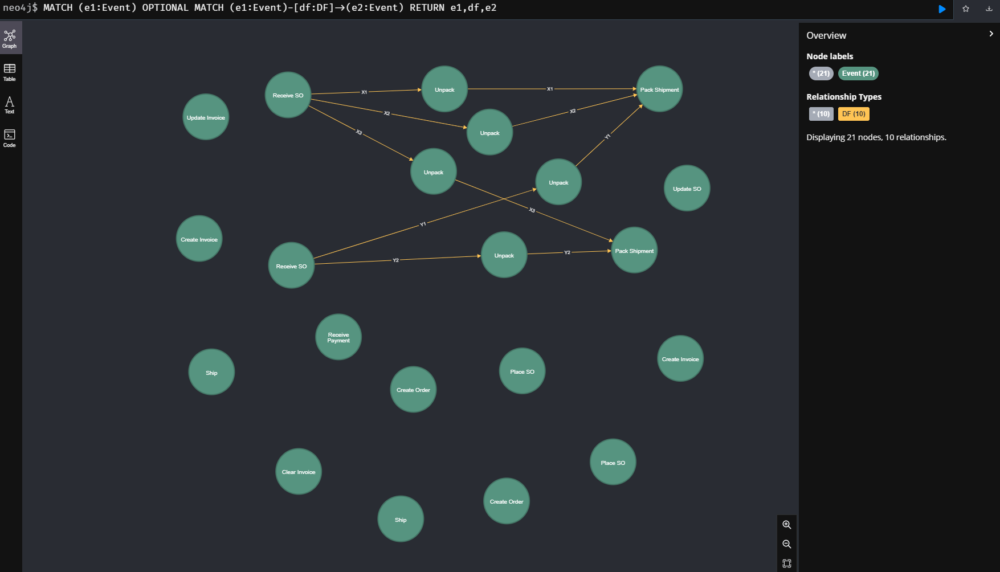

From this image we see that we only ordered a small subset of the events (those correlated to _Items_) with the other events not ordered yet. With the following query, we can also add the entity nodes to the picture.
```
MATCH (n:Entity)<-[c:CORR]-(e:Event)
OPTIONAL MATCH (e)-[df:DF]->(e2:Event) 
RETURN e,c,n,df,e2
```
, events, and df-relationships of 'Item' entities")
Though the complexity of the graph shows that we rather not visualize all the `:DF` and `:CORR` relationships together in a single visualization.

### 6.3 Infer directly-follows relationships for all entities

We started this part of the tutorial with only creating `:DF` relationships for _Item_ entities. However, the query for constructing DF relationships is entirely generic if we omit the `{EntityType:"Item"}` restriction on the first `MATCH` clause:
```
MATCH (n:Entity)
MATCH (n)<-[:CORR]-(e)
WITH n, e AS nodes ORDER BY e.timestamp, ID(e)
WITH n, collect(nodes) AS event_node_list
UNWIND range(0, size(event_node_list)-2) AS i
WITH n, event_node_list[i] AS e1, event_node_list[i+1] AS e2
MERGE (e1)-[df:DF {EntityType:n.EntityType, ID:n.ID}]->(e2)
```
That means, we no longer require domain knowledge about which property represents which entity of which type as this is fully materialized in the `:Entity` nodes and `:CORR` relationships of the event knowledge graph. Running the above generic query creates 19 `:DF` additional relationships for _Order_, _SupplierOrder_, _Invoice_, and _Payment_. The `MERGE` command prevents creation of `:DF` relationships for the _Item_ entities that we already created. And we did not create _Actor_ entity nodes, so their `:DF` relationships are not inferred. Querying with `MATCH (e1:Event) OPTIONAL MATCH (e1:Event)-[df:DF]->(e2:Event) RETURN e1,df,e2` gives us the following graph.

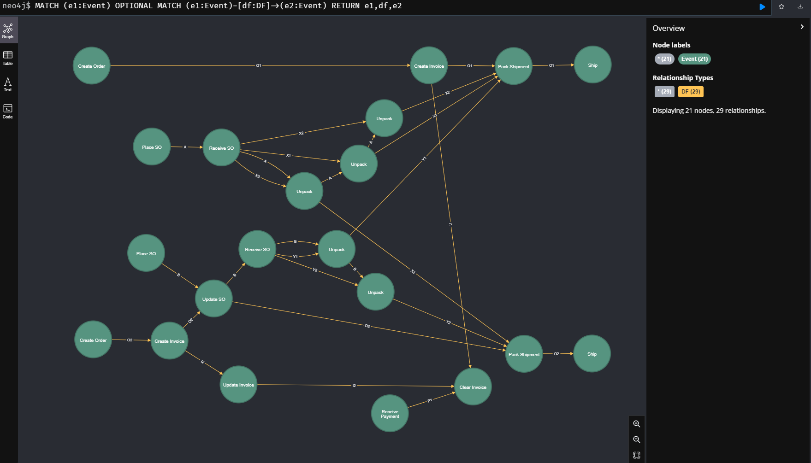

The graph shows
* all `:DF` relationships together form a _partial order_ over all `:Event` nodes
* the partial order consists of 12 distinct `:DF` paths that orders the events of each entity over time
* the `:DF` paths synchronize in several "shared" events

## 7. Wrap-Up and next steps

Congratulations! You've just learned all the basics for constructing event knowledge graphs:
* importing event records as event nodes
* identify entities and materialize event-entity references as `:Entity` nodes and `:CORR` relationships
* inferring and materializing temporal information as `:DF` paths

This tutorial introduced the basic query patterns for these steps for the specific concrete example of [./input_logs/order_process_event_table_orderhandling.csv](./input_logs/order_process_event_table_orderhandling.csv). The queries explicitly encoded domain knowledge about entities, making various queries rather repetitive. The next tutorial shows how to generate the various Cypher queries automatically using Python scripts, making the whole process more efficient.

Further, the resulting graphs have a rich structure which allows the following:
* Infer structural relations between entities and analyze interaction behavior between related entities (Tutorial)
* Query the event data based on behavioral and structural relationships to identify performance bottlenecks (Tutorial)
* Process discovery of models describing all behavioral information in aggregated form (Tutorial)
* Infer queues and analyze behavior in queues (Tutorial)
* Analyze human behavior in processes by identifying higher-level tasks and work patterns (Tutorial)
